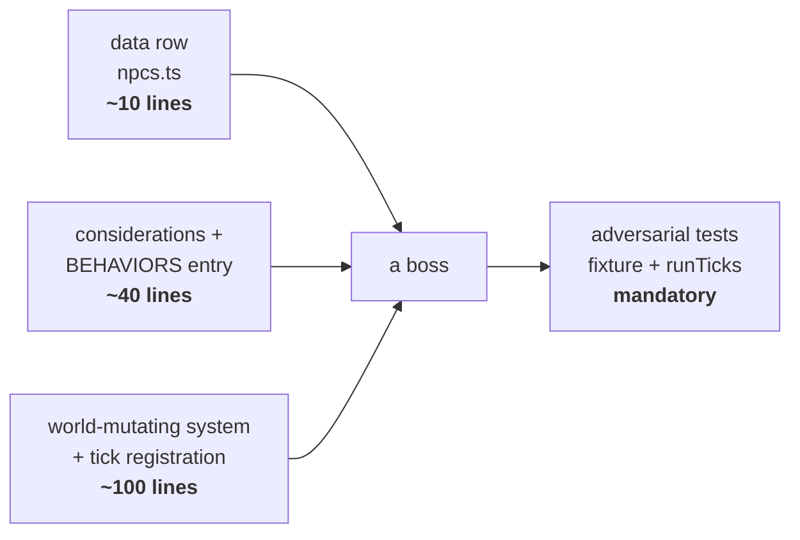

# Boss & mission variety — five bosses that are not Mireclaw with a new hat

Status: **design, not built.** Nothing here is implemented. Each boss is costed
against the engine as it exists on `main` today (`8c6c6c3`).

The bar this document sets for itself: **if two bosses are beaten by doing the
same thing, there is only one boss.** So every section below leads with the
*player verb* — the thing you have to do differently — and only then gets to the
monster.

---

## 1. The reference: what Mireclaw Alpha actually is

Before designing anything, the honest reading of the one boss that ships.

**In one line: Mireclaw Alpha is an attrition-denial fight. It heals itself by
standing in its own spore cloud, and the counterplay is to set the cloud on
fire.**

It is built out of exactly three pieces, and every boss after it can be built
out of the same three.

### Piece 1 — a data row

`src/game/data/npcs.ts:52-89`. A boss is not a class. It is a table entry:

```ts
archetype: 'boss',
faction: 'gang',
hp: 320,
speed: 3.2,
weapon: 'claws',
sightRange: 10,
hostility: 'always',
fleesOnDamage: false,
behavior: 'mireclaw',
resist: { physical: 0.75, burning: 1.25, poisoned: 0.5, spore: 0 },
```

The `resist` map is the most under-used field in the game. It is a
**per-damage-type multiplier**, read at `src/game/entity.ts:407`:

```ts
export const resistMult = (e: Entity, kind: string): number => e.resist?.[kind] ?? 1
```

Two things follow that the rest of this document leans on hard. It lives **on the
entity**, not on the archetype — so it can be mutated at runtime. And `0` means
immune while `> 1` means vulnerable — so "this boss can only be hurt by X" is
already expressible with no engine change at all.

Note also the tuning comment at `npcs.ts:76-78`: speed was set to `3.2` so the
`1.4×` enrage burst lands at `4.48`, "a hair under `PLAYER_SPEED` (4.5) — phase 3
is a chase you can barely win, not an unavoidable one." That is the standard
this doc tries to hold: **numbers chosen against a player capability, not vibes.**

### Piece 2 — a behavior, which is just an ordered list of considerations

`src/game/systems/behaviors.ts:939-942`:

```ts
mireclaw: {
  about: '#69 Mireclaw Alpha boss — phased: pressure & summon, retreat-to-spore-regen, then enrage',
  considerations: ['enrage', 'retreatToSpore', 'threat', 'hunt', 'wander'],
},
```

The AI is a **utility system with tiers**. Each consideration
(`behaviors.ts:867-895`, 26 of them registered) is a pure function returning zero
or more candidate goals, each with a `code`, a `score` and a `tier`. `decide()`
at `behaviors.ts:988-1018` takes the highest tier, then the highest score inside
it, with a 25% hysteresis bonus for the goal it already holds so a 1-hp DOT tick
cannot make it flip-flop.

Only **two** of Mireclaw's five considerations are its own:

```ts
// behaviors.ts:843 — Phase 3: below the enrage line it abandons self-preservation
const enrage: Consideration = (w, e) => {
  if (hp > max * MIRECLAW_ENRAGE_FRAC) return []
  ...
  return [{ code: dist <= ENGAGE_RANGE ? BATTLE : PURSUE, score: 20, tier: TIER_PANIC, target: p.id }]
}

// behaviors.ts:856 — Phase 2: wounded → walk to the nearest spore cloud and hold
const retreatToSpore: Consideration = (w, e) => {
  if (hp > max * MIRECLAW_RETREAT_FRAC || hp <= max * MIRECLAW_ENRAGE_FRAC) return []
  const spore = nearestSpore(w, e)
  if (!spore) return []          // no cloud to hide in → falls through to threat/hunt
  return [{ code: RETREAT, score: 6, tier: TIER_PANIC, at: { x: spore.pos.x, y: spore.pos.y } }]
}
```

`threat`, `hunt` and `wander` are the same functions a common thug uses.

**This is the cheapest lever in the whole engine.** A new boss "strategy", in the
movement/targeting sense, costs one pure function and one registry line.

`TIER_PANIC` is the trick worth stealing: it is normally the tier a *frightened*
NPC uses to run away, and both boss considerations occupy it precisely so nothing
else can outbid them. A boss is, mechanically, a monster whose panic is aimed at
you.

### Piece 3 — a world-mutating system

`src/game/systems/mireclaw.ts:97`. The considerations decide where the body goes;
this decides what the world does. Phases are read straight off the HP fraction
(`mireclaw.ts:108-127`):

| Phase | HP | What the system does |
|---|---|---|
| 1 | > 50% | `summonBrood` — 2 sporelings every 90 ticks, capped at 8 within 6 tiles |
| 2 | 20–50% | `+2 hp` every 15 ticks **while `inSafeCloud`** |
| 3 | < 20% | one-time `boss.speed *= 1.4`, latched on `ai.enraged` |

And the actual counterplay, `mireclaw.ts:91-95`:

```ts
const inSafeCloud = (w: World, boss: Entity): boolean => {
  const tx = Math.floor(boss.pos.x)
  const ty = Math.floor(boss.pos.y)
  return sporeAt(w, tx, ty) && !fireAt(w, tx, ty) && !hasStatus(boss, 'burning')
}
```

Three cell/status reads. **That is the entire fight.** The reason the fight feels
designed is not complexity — it is that the counterplay is a *thing the player
already had a reason to carry* (fire), pointed at *a thing they can see* (the
cloud), on *a clock they can feel* (the health bar stops going down).

### Piece 4, which is not a piece — the reveal

`mireclaw.ts:82-88` latches a `bossReveal` event on the first unbroken line of
sight from a live player within 11 tiles, and **nothing in the boss brain runs
until it fires** (`mireclaw.ts:106`). The comment explains why: without it the
summon throttle ran from tick 0 and the Alpha hit its 8-brood cap ten seconds
into the floor, minutes before anyone opened the door, so players met "a static
room of sporelings and never saw a boss summon anything."

**Every boss below inherits this.** A boss that acts before it is witnessed
spends its whole kit on an empty room. Reuse `maybeReveal`; do not re-derive it.

### So: what a new boss costs



Floor: ~150 lines plus tests, for a boss that reuses existing verbs. Anything
past that is new engine surface, and each design below says exactly how much and
why.

---

## 2. The five

Ordered **cheapest first**, which is also roughly best-first — the two that cost
least lean hardest on systems that already ship.

At a glance:

| # | Boss | The player verb | New engine work |
|---|---|---|---|
| 1 | **The Vigil** | *be quiet* — refuse your loud tools | ~80 lines |
| 2 | **Echo** | *never repeat a damage type* | ~90 lines |
| 3 | **The Sealkeeper** | *demolish* — keep your lanes open | ~130 lines |
| 4 | **Mirefather** | *shoot the floor, not the boss* | ~170 lines |
| 5 | **The Hollow Choir** | *split up and kill on a count* | ~180 lines |

Mireclaw's own verb — *deny the heal with fire* — makes six, all different.

---

### 1. The Vigil — the boss you are trying not to fight

> A cathedral-sized thing fused into the reactor bulkhead. It has not moved in
> years. It does not need to.

**Player verb: be quiet.** Every loud tool that beats every other boss —
grenades, breaching doors, gunfire, setting fires — is what kills you here.

**The fight.** The Vigil starts dormant and is **vulnerable only while dormant**
(`resist.physical` around `1.5` asleep, `0.15` awake). Awake it is not a boss you
beat; it is a boss you survive until it settles. So the fight is a **noise
budget**: get in, do damage in silence, and back off before the stimulus meter
trips. Killing it with a pistol is possible and slow. Killing it with a grenade
is impossible, because the grenade wakes it.

Escalation is honest and readable: each wake is longer than the last, and the
third one does not end.

**What it demands that nothing else does.** Weapon *choice as a restriction*, and
lock-picking over breaching. It is the only fight where the correct play is to
put your best tool away. In co-op it is the only fight where one player being
loud loses it for everyone — which is a social mechanic, not a mechanical one.

**Engine — this is mostly assembly, which is why it is first:**

- `src/game/systems/dormancy.ts` and the `woke` event already exist, and `woke`
  already carries `by` naming the stimulus kind: **`noise / proximity / damage /
  power-cut / spore / fire`**. That list is the boss's entire input vocabulary,
  already implemented.
- `src/game/systems/stimulus.ts` + the `noise` SimEvent + `emitNoise` in
  `world.ts` (imported by `combat.ts:7`) already emit on gunfire.
- The `lurker` behavior (`behaviors.ts:947-950`, `pounce` consideration) is a
  working dormant-until-tripped brain to crib from.
- `cutPower(w, wing, agentId)` (`objects.ts:78-86`) already gives players a way
  to darken a wing — a real lever for reducing its perception.

**New work (~80 lines + tests):** a `vigil.ts` system holding a per-boss noise
accumulator that decays, a wake threshold, escalating wake durations, and the
dormant/awake `resist` swap. Everything it reads already exists.

**Risks.** Stealth needs feedback or it is unfair — the player must *see* the
meter filling. The annotation system (`types.ts` `Annotation`, entity-anchored
via `targetId`) is the honest answer and needs no new render code. Second risk:
solo play must stay winnable, so the threshold should scale with live player
count, not be a flat constant.

---

### 2. Echo — the boss that learns

> It was a research subject once. It kept the part of the job that involved
> adapting.

**Player verb: never hit it the same way twice.**

**The fight.** Echo's `resist` map is **mutable at runtime**. Every time it takes
damage of a kind, its resistance to that kind climbs — `physical` up a step per
N damage taken, elements up a step per application — and decays slowly when
unused. Hold the trigger on one weapon and your DPS visibly falls off a cliff.
Rotate — pistol, then fire mod, then shock, then melee — and it never adapts.

In co-op this is a **role split by element**: two players on the same damage type
are, together, worse than one.

**What it demands that nothing else does.** It is the only fight that punishes
mastery of a single loadout, and it is a direct answer to the pistol-only meta
the `feat/one-weapon` work created. It makes the mod pickups scattered by
`populate.ts:778 scatterModPickups` matter for the first time.

**Engine — nearly free, because the field is already per-entity:**

- `resistMult` (`entity.ts:407`) reads `e.resist?.[kind]`, an **entity field**.
  Adaptation is literally `boss.resist.burning += step`. No new component.
- Every damage path already funnels through `resistMult`: `combat.ts:159` and
  `:170` for physical, `fire.ts:113` for element DOTs. One hook point per path,
  and there are only three.
- The `hit` SimEvent already carries `targetId` and `amount`, so the UI can show
  the adaptation without new plumbing.
- `ELEMENTS` (`src/game/data/elements.ts:15-25`) gives six distinct damage kinds
  to rotate through: `burning · frozen · wet · electrified · poisoned · spore`.

**New work (~90 lines + tests):** an `echo.ts` system that decays resistances per
tick, a damage-kind tap, per-kind caps (never fully immune — cap at ~0.2 so a
stubborn player is slowed, not walled), and a readable tell per kind.

**Risks.** Legibility. "Why is my gun bad now" is a terrible feeling unless the
game says so. Cheapest fix: a per-kind icon row on the boss health bar
(`src/ui/bossModel.ts` already owns that bar). Second risk: the caps must be
tested adversarially — a party that only owns a pistol must still be able to win,
slowly.

---

### 3. The Sealkeeper — the boss that fights the architecture

> It does not want to kill you. It wants the wing sealed, and you are inside it.

**Player verb: demolish. Keep your lanes open, and blow open the ones it closed.**

**The fight.** The Sealkeeper barely engages. It retreats, **shuts and re-locks
doors behind it**, plants barricades in chokepoints, and cuts power to the wing
for darkness. Meanwhile a clock runs — reuse the `contain` bloom timer. Chase it
and you get sealed into a dead room with its adds. The answer is that **your
grenades stop being a weapon and become a tool**: breach the door it locked
(`doorBreach` already exists), destroy the barricades (already destructible),
restore power at a generator.

**What it demands that nothing else does.** Spatial awareness and route
management, in a game that otherwise never asks for it. It is the only fight
where standing still and shooting is a *loss condition*, and the only one that
makes the level layout a combatant.

**Engine — the pieces exist, the boss-side ability does not:**

- The `fortify` consideration and the whole `barricader` behavior already ship
  (`behaviors.ts:943-946`); the `barricade` SimEvent is already defined in
  `types.ts`. Barricade-building is **done**.
- `cutPower(w, e.wing, agent.id)` (`objects.ts:82`) takes **any** `agent: Entity`
  — nothing in it assumes a player. A boss can already cut power.
- `doorToggle`, `doorBlocked`, `doorBreach` SimEvents all exist, so doors already
  open, close, refuse to crush a body, and blow open to explosives.
- `bloomTick` on the mission (`missions.ts:126`, `BLOOM_TICKS = 40 * 30`) is a
  working soft-fail countdown to reuse rather than reinvent.
- `raiseFloorAggro` (imported at `missions.ts:8`) already escalates a floor.

**New work (~130 lines + tests):** a `sealDoor` consideration steering it to the
doorway between it and the players, a `sealkeeper.ts` that performs the close +
re-lock and throttles the power cut, and — the one genuinely new rule — **NPC
door-closing must respect `doorBlocked`**, or it entombs a player permanently.
That safety case already exists for the player path and must be wired to this
one. See "a defence that exists somewhere in the codebase is not a defence of the
codebase."

**Risks.** The real hazard is a **softlock**: a party sealed in a room with no
grenades and no pickable door. Mitigation is the rule missions.ts already
follows — every seal must leave a breach path, and the pick channel
(`interaction.pickTicks`) must work on anything the boss locks. This needs an
adversarial test with an empty inventory, not a happy-path one.

---

### 4. Mirefather — the boss you cannot shoot

> Something the bog grew on purpose, to carry the bog with it.

**Player verb: stop shooting the boss. Shoot the ground it is standing on.**

**The fight.** Mirefather is sheathed in bog water — while `wet` it has
`resist.physical ≈ 0.1`. Bullets are nearly useless. It **floods tiles as it
moves**, leaving wet ground behind it, and it prefers to stand in it.

The counterplay is the `wet + electrified` interaction the engine already treats
as special: **electrify the water and the sheath becomes the weapon.** Shock the
puddle it is standing in and it takes the full hit and is immobilized.

This is the deliberate inverse of Mireclaw. Mireclaw *denies* you the terrain it
made (burn the cloud so it cannot heal). Mirefather makes you *use* the terrain
it made. Same system, opposite verb.

**What it demands that nothing else does.** Attacking the world instead of the
body, and patience — you wait for it to be standing in the right cell rather than
shooting on sight. It is the only fight with a positional *timing* window.

**Engine — the pattern exists; one hazard type is missing:**

- `wet` and `electrified` are real elements (`elements.ts:18-19`) and already
  interact: `IMMOBILIZE_STATUSES = new Set(['electrified', 'frozen'])`
  (`statusFx.ts:38`), with chain-lock protection at `:43-47`
  (`IMMOBILIZE_IMMUNE_TICKS`, `IMMOBILIZE_CHAIN_TICKS`) so a stun-lock is already
  prevented — that safety is written and tested.
- Cell hazards are an established, twice-implemented pattern:
  `igniteCell(w,tx,ty)` (`fire.ts:41`), `seedSpore` / `spawnSporeBurst`
  (`spore.ts:51,60`), each with a matching `fireAt` / `sporeAt` cell query. A
  water cell is the **third instance of a shape that already has two**.
- `retreatToSpore` (`behaviors.ts:856`) is the exact template for "walk to the
  nearest cell of my favourite kind."
- Weapon mods already apply elements on hit (`data/mods.ts:71`, "an element
  applied to whatever the bullet strikes"), so a shock mod is the delivery
  mechanism and needs no new item.

**New work (~170 lines + tests):** a `water.ts` hazard cell mirroring `fire.ts`
(`waterAt`, `floodCell`, decay), the `wet ⇒ physical resist` rule on the boss,
a `standInWater` consideration, and the electrified-water conduction rule
(shock a wet cell → every entity on it). That last one is the fun part and the
part most likely to have emergent consequences worth testing for.

**Risks.** Conduction is a systemic change, not a boss change — it will affect
players standing in their own puddles, which is *correct* and *dangerous*.
Deliberate friendly-fire needs a design call before it ships. Also: if the party
has no shock mod, the fight must still be winnable (slowly, at range, on dry
ground), or a bad loot roll dead-ends a run.

---

### 5. The Hollow Choir — the boss that is not one body

> Three of them. They only ever speak together.

**Player verb: split the party, and kill on a count.**

**The fight.** A `Choirmaster` core plus three `Herald` bodies. The core takes
**zero** damage while any herald lives. Heralds are individually weak but
**resurrect ~8 seconds after dying** unless all three are down at once. And they
actively spread — a herald whose siblings are close to it moves away.

So the fight is a **coordination puzzle, not a DPS check**: the party splits,
each takes a herald, and they burst on a call. Two players cannot brute-force it
by stacking; that is the entire point.

**What it demands that nothing else does.** Splitting up. Every other fight in
this game — including the four above — rewards the party staying together. This
one punishes it, and is the only design here whose difficulty scales *down* with
better communication rather than better gear.

**Engine — the most new surface of the five, and the only one needing a new
component:**

- `resist` gives invulnerability for free: set `core.resist.physical = 0` while
  linked. **No new damage-gating code** — the mechanic rides the existing
  multiplier.
- The `squad` behavior (`behaviors.ts:951-957`) already coordinates a group with
  `squadFlank` / `squadStack` / `squadFollow`, so the "spread apart" consideration
  is an inversion of code that exists rather than a new idea.
- `spawnNpc` + the summon pattern (`mireclaw.ts:50-61`) already covers
  resurrection; a herald respawn is a throttled summon at a fixed anchor.
- `bossReveal` and `src/ui/bossModel.ts` currently pin **one** health bar to one
  entity — this is the one design that needs UI work.

**New work (~180 lines + tests):** a `link` field on `Entity` (`linkId`, or a
`choir` group id), a `choir.ts` system maintaining the invulnerability latch and
the resurrect timers, a `spreadFromKin` consideration, and a bossModel change to
show a core bar plus three pips. Serialization is free — `Entity` is a plain
object and `serializeWorld` round-trips whatever is on it.

**Risks.** Solo play. Three heralds that resurrect independently is unbeatable
alone, so herald count must scale with live players (1 solo, 2 duo, 3 trio+) or
the resurrect delay must scale. That is a design constraint, not a bug to find
later — write the solo test first. Second risk: three revealed bosses at once is
a lot of screen; the pips need to be legible on a phone.

---

## 3. Mission variety — the other half

The bosses above are worth little if all five are met the same way: *walk to the
far building, open the door, fight the thing in the middle.* Today that is
exactly what happens.

### What exists

`generateMission` (`missions.ts:66-108`) and `generateSporefallMission`
(`:115-140`) produce **five templates**:

| Template | Objective | Gate | Fail |
|---|---|---|---|
| `reach` | get to the Launch Bay | — | none (fallback when there is no building) |
| `steal` | grab the specimen canister | any scheme | none |
| `assassinate` | kill the Mireclaw Alpha | any scheme | none |
| `contain` (floor 5+) | burn the Spore Node before `bloomTick` | overgrown | **soft** — it blooms, the room floods |
| `infiltrate` (floor 5+) | breach a biolock, kill the Mireclaw | biolock | none |

Three real strengths to build on, not replace:

1. **The access gate is already a variety multiplier.** `applyAccessGate`
   (`missions.ts:142+`) dresses the objective doorway as one of three puzzles —
   **keycard, power-cut, or overgrown-burn-it** — chosen from a dedicated RNG
   fork, and every scheme leaves a grenade breach open so a run is never
   dead-ended. That is one mission shape presenting three different problems.
2. **The escalation is already there and it is good.** `bossDoorBreached` turns
   the floor hostile at a point of no return; `stationAlert` unseals every door
   and sets every NPC hunting the player who took the prize. Those are strong
   beats that only two templates currently use.
3. **`bloomTick` is a working soft-fail** — a timer that makes the floor harder
   rather than ending the run. That is the right model for pressure in a
   roguelite and it is currently used exactly once.

### The real gap

Every template is **fetch or kill, once, in the far room.** Specifically:

- Only one has a **clock** (`contain`).
- **None** has a real fail state — nothing can end a run except dying.
- None asks the party to **hold ground**, **move something**, or **do two things
  at once**.
- None uses `stationAlert` as anything but a victory lap; it fires *after* the
  objective, so the escape it creates is decoration.

### Six additions, cheapest first

Each names the machinery it reuses, because the point is that most of this is
recombination.

**A. `holdout` — defend a point for N ticks.** Bring the reactor online and keep
it alive while waves escalate. Reuses `bloomTick` (a countdown that already
serializes), `spawnEncounters` (`populate.ts:542`, already weighted by floor and
theme), and `raiseFloorAggro`. The first mission where the party cannot advance
to win. **Small.**

**B. `blackout` — the wing starts unpowered.** `powerCut` and `cutPower` already
exist and already gate an access scheme; here it is the *premise*. Darkness cuts
`sightRange` both ways, so it is a stealth mission by default and pairs
naturally with **The Vigil**. Restoring power at the generators is the objective.
**Small** — mostly a lighting/LOS question the renderer may already answer.

**C. `extraction` — invert the alarm.** Fire `stationAlert` at **pickup**, not at
completion. You start with the prize and the objective is the door you came in
by. The machinery is identical; only the ordering changes. This is the single
highest ratio of new-feeling to lines-changed in the document. **Small.**

**D. `cascade` — three Spore Nodes, sequenced.** Each bloom makes the next
harder (spores already spread and already damage over time). Turns `contain` from
one timer into a routing problem, and gives co-op a genuine split-up objective.
**Medium** — needs multi-target mission state; `targetEntityId` is currently
singular.

**E. `escort` — the objective walks.** Move a canister, a survivor, or a powered
cart to the bay. Carrying should cost something — noise, or a slot, or speed.
NPC pathing, `patrol` waypoints (`assignPatrol`, `populate.ts:876`) and
`squadFollow` already exist, so a follower is not new. **Medium.**

**F. Floor modifiers, orthogonal to template.** The cheapest variety in the
document, because it multiplies rather than adds: *bog tide* (spores creep all
floor), *brownout* (power fails periodically), *hunted* (one stalker tracks the
party across the whole floor, using the `manhunt` consideration that already
exists). Five templates × six modifiers reads as far more than eleven missions.
**Small each.**

### The constraint that governs all of it

`missions.ts:76-81` is a warning written by someone who got bitten:

> Gated to floor >= 5 (nothing pins deep floors), and drawn only there: the `&&`
> short-circuits on shallow floors so the mission RNG stream stays byte-identical
> to the frozen steal/assassinate placement table.

**Adding a mission template must not perturb the RNG stream**, or every existing
seed generates a different floor and every recorded fixture and replay breaks.
New draws go on a **dedicated `rng.fork(...)`**, or behind a short-circuit that
cannot execute on the floors the old table owns. This is not optional and it is
not obvious from reading the function top-down — it is the first thing a
reviewer should check on any mission PR.

---

## 4. Build order

Each line is an independently deployable PR. They do not need to land in order,
but this order front-loads the cheapest proof.

| PR | What | Why here |
|---|---|---|
| 1 | this document | the plan, reviewable on its own |
| 2 | **The Vigil** | ~80 lines; proves the pattern on shipped systems |
| 3 | `extraction` mission | ~small; biggest feel-change per line in the doc |
| 4 | **Echo** | ~90 lines; makes existing mod pickups matter |
| 5 | `holdout` mission | first mission you cannot win by advancing |
| 6 | **The Sealkeeper** | needs the NPC door-close safety case done properly |
| 7 | water cells + conduction | **systemic** — lands alone, before its boss |
| 8 | **Mirefather** | rides on 7 |
| 9 | `link` component + boss UI | **systemic** — lands alone, before its boss |
| 10 | **The Hollow Choir** | rides on 9 |
| 11 | floor modifiers | multiplies everything above |

Two rules the table encodes. **Systemic changes ship before the boss that needs
them** (7 before 8, 9 before 10) so a boss PR is never also an engine PR. And
**every boss PR carries its adversarial tests and an `e2e/` recording** — the
repo's testing mandate is explicit that a gameplay feature produces a video, and
a boss nobody has watched fight is a boss nobody has tested.

### Before writing any of it

Two things this document did **not** do, which the implementer should:

- **Play the reference.** The `gameplay-experiments` and `ecs-debug` skills exist
  to compose a deterministic scenario and inspect the live world. Fight the
  Mireclaw in the debugger, watch the phase transitions fire, and check that the
  three-line reading in §1 matches what actually happens on screen before
  building five more on top of it.
- **Check the solo case first, not last.** Three of these five (Vigil, Choir,
  Sealkeeper) have a plausible solo-unwinnable failure mode, and all three are
  cheaper to design around than to patch after.
