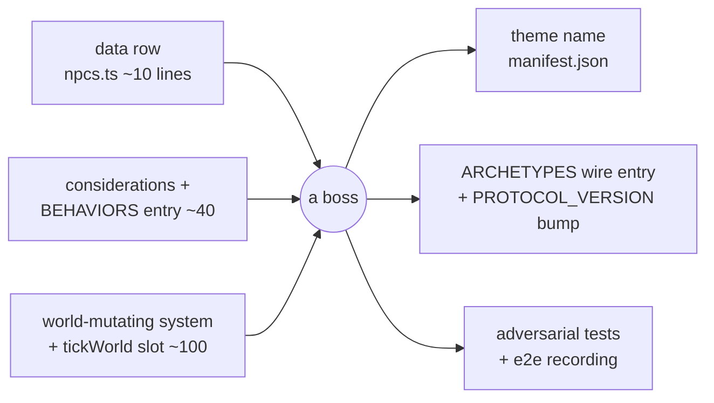

# Boss & mission variety — five bosses that are not Mireclaw with a new hat

Status: **design, not built.** Nothing here is implemented. Everything is costed
against `main` at `8c6c6c3`.

The bar this document sets for itself: **if two bosses are beaten by doing the
same thing, there is only one boss.** So every section leads with the *player
verb* — the thing you have to do differently — and only then gets to the monster.

Two things were found while grounding this that matter more than any single boss
design, so they are up front: **there is a one-button exploit that instant-kills
any boss in the game today** (§3.1), and **the boss HUD is hardcoded to
Mireclaw's three phases**, so no second boss can display correctly until that is
generalized (§3.2).

---

## 1. The reference: what Mireclaw Alpha actually is

**In one line: Mireclaw Alpha is an attrition-denial fight. It heals itself by
standing in its own spore cloud, and the counterplay is to set the cloud on
fire.**

It is built from exactly three pieces, and every boss below is built from the
same three.

### Piece 1 — a data row

`src/game/data/npcs.ts:52-89`. A boss is not a class:

```ts
archetype: 'boss',
faction: 'gang',
hp: 320,
speed: 3.2,
weapon: 'claws',
sightRange: 10,
hostility: 'always',
fleesOnDamage: false,
behavior: 'mireclaw',
resist: { physical: 0.75, burning: 1.25, poisoned: 0.5, spore: 0 },
```

`resist` is the most under-used field in the game — a **per-damage-type
multiplier**, read at `src/game/entity.ts:407`:

```ts
export const resistMult = (e: Entity, kind: string): number => e.resist?.[kind] ?? 1
```

Two facts the rest of this document leans on. It lives **on the entity**, not the
archetype, so it can be mutated at runtime. And `0` means immune while `> 1`
means vulnerable — so "this boss can only be hurt by X" is already expressible
with **no engine change at all**. Per the survey: *"there is NO shield component,
no armor component, no damage-reduction buff… damage reduction is expressed only
through `resist` multipliers."* That is a constraint and an invitation.

Note the tuning comment at `npcs.ts:76-78`: speed is `3.2` so the `1.4×` enrage
burst lands at `4.48`, "a hair under `PLAYER_SPEED` (4.5) — phase 3 is a chase
you can barely win, not an unavoidable one." That is the standard this doc tries
to hold: **numbers chosen against a player capability.**

### Piece 2 — a behavior, which is just an ordered list of considerations

`src/game/systems/behaviors.ts:939-942`:

```ts
mireclaw: {
  about: '#69 Mireclaw Alpha boss — phased: pressure & summon, retreat-to-spore-regen, then enrage',
  considerations: ['enrage', 'retreatToSpore', 'threat', 'hunt', 'wander'],
},
```

The AI is a **tiered utility system**. 26 considerations are registered
(`behaviors.ts:867-895`); each is a pure function returning candidate goals with
a `code`, a `score` and a `tier` (`TIER_AMBIENT 0 · TIER_MEMORY 1 · TIER_THREAT 2
· TIER_PANIC 3`, `behaviors.ts:72-75`). `decide()` (`:988-1018`) takes the
highest tier, then the highest score within it, with a 25% hysteresis bonus for
the incumbent goal so a 1-hp DOT tick cannot make it flip-flop.

Only **two** of Mireclaw's five considerations are its own:

```ts
// behaviors.ts:843 — Phase 3: below the enrage line it abandons self-preservation
const enrage: Consideration = (w, e) => {
  if (hp > max * MIRECLAW_ENRAGE_FRAC) return []
  ...
  return [{ code: dist <= ENGAGE_RANGE ? BATTLE : PURSUE, score: 20, tier: TIER_PANIC, target: p.id }]
}

// behaviors.ts:856 — Phase 2: wounded → walk to the nearest spore cloud and hold
const retreatToSpore: Consideration = (w, e) => {
  if (hp > max * MIRECLAW_RETREAT_FRAC || hp <= max * MIRECLAW_ENRAGE_FRAC) return []
  const spore = nearestSpore(w, e)
  if (!spore) return []          // no cloud to hide in → falls through to threat/hunt
  return [{ code: RETREAT, score: 6, tier: TIER_PANIC, at: { x: spore.pos.x, y: spore.pos.y } }]
}
```

`threat`, `hunt` and `wander` are the same functions a common thug uses.

**This is the cheapest lever in the engine.** A new boss "strategy", in the
movement/targeting sense, costs one pure function and one registry line.

`TIER_PANIC` is the trick worth stealing: normally the tier a *frightened* NPC
uses to run away, and both boss considerations sit there precisely so nothing can
outbid them. A boss is, mechanically, a monster whose panic is aimed at you.

### Piece 3 — a world-mutating system

`src/game/systems/mireclaw.ts:97`, registered in `tickWorld`
(`world.ts:257-290`) after HP, fire and spore settle. The considerations decide
where the body goes; this decides what the world does. Phases read straight off
the HP fraction (`mireclaw.ts:108-127`):

| Phase | HP | What the system does |
|---|---|---|
| 1 | > 50% | `summonBrood` — 2 sporelings / 90 ticks, capped at 8 within 6 tiles |
| 2 | 20–50% | `+2 hp` every 15 ticks **while `inSafeCloud`** |
| 3 | < 20% | one-time `boss.speed *= 1.4`, latched on `ai.enraged` |

And the actual counterplay, `mireclaw.ts:91-95`:

```ts
const inSafeCloud = (w: World, boss: Entity): boolean => {
  const tx = Math.floor(boss.pos.x)
  const ty = Math.floor(boss.pos.y)
  return sporeAt(w, tx, ty) && !fireAt(w, tx, ty) && !hasStatus(boss, 'burning')
}
```

Three cell/status reads. **That is the entire fight.** It feels designed not
because it is complex but because the counterplay is *a thing the player already
carried* (fire), pointed at *a thing they can see* (the cloud), on *a clock they
can feel* (the health bar stops going down).

### Piece 4, which is not a piece — the entrance

`mireclaw.ts:82-88` latches a `bossReveal` on the first unbroken line of sight
from a live player within 11 tiles, and **nothing in the boss brain runs until it
fires** (`:106`). The comment says why: without it the summon throttle ran from
tick 0 and the Alpha hit its 8-brood cap ten seconds into the floor, minutes
before anyone opened the door, so players met "a static room of sporelings and
never saw a boss summon anything."

**Every boss below inherits this.** A boss that acts before it is witnessed
spends its whole kit on an empty room. Reuse `maybeReveal`; do not re-derive it.

---

## 2. What a boss actually costs



The two boxes on the right are the ones that get forgotten, and both are
mandatory — see §3.3 and §3.4.

---

## 3. Five constraints that kill naive boss designs

Found while grounding this. Read these before writing any of the five.

### 3.1 ⚠️ Any boss can be instant-killed with the freeze ray, today

`combat.ts:136-164` — an impact on a **frozen NPC is an instant kill** (`shatter`
at `:67-80`). Players crack the ice instead and never shatter (`:163`).

`freezeRay` (`items.ts`) does 0 damage and applies `frozen` for 120 ticks. So:
**freeze the Mireclaw Alpha, hit it once, and 320 hp evaporates.** Nothing in
`NPCS.boss` prevents this — its `resist` map has no `frozen` key, so
`resistMult` returns the default `1`.

Every boss in this document needs `resist.frozen = 0`, or the shatter rule needs
a "bosses crack like players" branch. **This should be its own PR, and it should
land before anything else here** — it is a live bug in the shipping boss, not a
new-content concern. It is also a nice illustration of the repo's own maxim: a
defence that exists (players cannot be shattered) is not a defence of the system.

### 3.2 ⚠️ The boss HUD is hardcoded to Mireclaw

`src/ui/bossModel.ts` imports `MIRECLAW_RETREAT_FRAC` / `MIRECLAW_ENRAGE_FRAC`
directly (`bossModel.ts:14`) and maps them to three fixed labels
(`PHASE_LABEL`, `:54`, resolved by the HP-band ladder at `:62-63`) —
*"SUMMONING BROOD" / "REGENERATING — BURN THE SPORES" / "ENRAGED"*.

A second boss with different phases will show **Mireclaw's phase text over its
own health bar**. Generalizing this — phases as data on the boss rather than
imported constants — is a **shared prerequisite for all five** and is PR #2.

### 3.3 ⚠️ There is no telegraph system, and this is already ticketed

Grep across `src/` for `telegraph|windup|castTime|chargeUp` finds nothing but an
unrelated aim-reticle comment. Attacks are `combat.cooldown` and nothing else.
**Open issue #1, "Enemy attacks need wind-up, telegraph and recovery"** (open
since 2026-08-08) is exactly this, and every boss below is better with it and
several are unfair without it.

The good news: it can be built from parts that exist — a tick window on `ai`, a
new `SimEvent` (events are JSON pass-through to BLE clients, `netHost.ts:190`, so
a new one reaches remote players for free), and the **annotation system**
(`types.ts:59-77`), which is explicitly inert to the sim and can draw an AoE
circle telegraph with no new render code.

Also relevant: `THINK_INTERVAL = 5` (`ai.ts:20`). **Bosses think at 6 Hz, not
30.** A wind-up must be counted in the boss's own system, not in a consideration.

### 3.4 ⚠️ A new archetype that is not registered on the wire decodes as a player

`src/net/protocol/messages.ts:13+` — `ARCHETYPES` is an **append-only u8 index**.
A new boss or add archetype must be appended *and* `PROTOCOL_VERSION` bumped
(`net/types.ts:7-20`, currently `3`), or remote clients decode it as `'player'`
(`:239`, `ARCHETYPES[r.u8()] ?? 'player'`).

And the cap that constrains every summoner: `sendSnapshots`
(`netHost.ts:226-252`) uses `INTEREST_RADIUS = 14` tiles and a **hard cap of 48
entities per snapshot** (`:242`). **A boss that spawns a large swarm starves its
own teammates' snapshots.** Mireclaw's `MAX_BROOD = 8` is not arbitrary.

### 3.5 ⚠️ The sim never mutates tiles

`serialize.ts:5-7`: the level is *"regenerable from seed+floor and never mutated
at runtime"*, and `deserializeWorld` **throws** on a `levelChecksum` mismatch
(`:89-91`).

**So no boss can open, close or reshape terrain.** Everything spatial must be
entity-based, and there are exactly three tools:

- **doors** — a closed door's tile *is* solid (`world.isBlocked:254`);
- **barricades** — destructible, shovable, and deliberately **never solid**, so
  BFS reachability survives (`behaviors.ts:636-638`);
- **hazard cells** — `fire` and `spore` are **entities**, not tiles
  (`spore.ts:53` gives spore clouds `kind: 'fire'`), so a new hazard cell type is
  legal and is a well-trodden path.

There is also **no lighting or darkness system** anywhere in the sim, and no
LOS-blocking cover — only solid tiles and closed doors block sight
(`los.ts:8-41`). Any design that says "fights in the dark" is proposing a new
renderer feature, not using one.

---

## 4. The five

Ordered **cheapest first**, which is also roughly best-first — the two that cost
least lean hardest on shipped systems.

| # | Boss | The player verb | New engine work |
|---|---|---|---|
| 1 | **The Vigil** | *be quiet* — refuse your loud tools | ~80 lines |
| 2 | **Echo** | *never repeat a damage type* | ~90 lines |
| 3 | **The Sealkeeper** | *demolish* — keep your lanes open | ~130 lines |
| 4 | **Mirefather** | *shoot the ground, not the boss* | ~150 lines |
| 5 | **The Hollow Choir** | *split up and kill on a count* | ~180 lines |

Mireclaw's own verb — *deny the heal with fire* — makes six, all different.

---

### 1. The Vigil — the boss you are trying not to fight

> Something enormous fused into the reactor bulkhead. It has not moved in years.
> It does not need to.

**Player verb: be quiet.** Every loud tool that beats every other boss — the
grenade, the breach, the machinegun, the fire — is what kills you here.

**The fight.** The Vigil starts dormant and is **vulnerable only while dormant**
(`resist.physical ≈ 1.5` asleep, `≈ 0.15` awake). Awake, it is not a boss you
beat; it is a boss you survive until it settles. The fight is a **noise budget**:
get in, do damage in silence, back off before the meter trips. Killing it with a
knife is slow and possible. Killing it with a grenade is impossible, because the
grenade wakes it. Each wake is longer than the last; the third does not end.

**What it demands that nothing else does.** Weapon choice as a *restriction*, and
lock-picking over breaching. It is the only fight where the correct play is to
put your best tool away, and — in co-op — the only one where one player being
loud loses it for everyone. That is a social mechanic, which nothing else here
is.

**Engine — this is mostly assembly, which is why it is first:**

- `src/game/systems/dormancy.ts` already runs *before* the AI system
  (`awakeningSystem`, `world.ts:257`) and already implements the full trigger
  vocabulary: `power-cut`, `proximity` (range 3), `damage` (within 20 ticks via
  `health.lastHurtTick`), `door` (range 4), and environmental `noise` / `fire` /
  `spore` at `WAKE_STIMULUS_RANGE 7` (`dormancy.ts:40-64`). It emits `woke{by}`.
  **That is the boss's entire input vocabulary, already written.**
- `emitNoise` (`world.ts:224`, `NOISE_TTL 90`) is already called by `fireWeapon`
  and by `detonate` (`combat.ts:367`) — **the grenade already announces itself.**
- `src/game/systems/stimulus.ts` gives graded intensities to bait against:
  `NOISE_INTENSITY 4`, `FIRE_INTENSITY 7`, `SPORE_INTENSITY 3 + fuel/80`, falling
  off as `intensity/(1+dist*0.12)`. It is explicitly *"baitable/misdirectable by
  design"* — so a thrown distraction is a real play.
- The `lurker` behavior (`behaviors.ts:947-950`) and its `pounce` consideration
  (`:715-729`, TIER_PANIC score 15, "nothing breaks it off") is a working
  dormant-until-tripped brain to crib from.

**New work (~80 lines + tests):** a `vigil.ts` holding a decaying noise
accumulator, a wake threshold, escalating wake durations, and the dormant/awake
`resist` swap. Everything it reads exists.

**Risks.** *Stealth without feedback is unfair* — the player must see the meter
filling, and the annotation system is the honest answer with no new render code.
*Solo must stay winnable*: the threshold should scale with live player count.
*The `damage` wake trigger fires on any hit* (`dormancy.ts`), so "hit it while
asleep" needs an explicit exemption or the design contradicts itself on the first
shot — that is the first test to write.

---

### 2. Echo — the boss that learns

> It was a research subject once. It kept the part of the job that involved
> adapting.

**Player verb: never hit it the same way twice.**

**The fight.** Echo's `resist` map is **mutable at runtime**. Each damage kind it
takes raises its resistance to that kind, decaying slowly when unused. Hold the
trigger on one weapon and your damage visibly falls off a cliff. Rotate — pistol,
then incendiary, then shock, then melee — and it never adapts.

In co-op this is a **role split by element**: two players on the same damage type
are, together, worse than one.

**What it demands that nothing else does.** It is the only fight that punishes
mastery of a single loadout, and it is a direct answer to the pistol-only meta
`feat/one-weapon` created. It makes the mod pickups scattered by
`populate.ts:778` matter for the first time.

**Engine — nearly free, because the field is already per-entity:**

- `resistMult` (`entity.ts:407`) reads `e.resist?.[kind]`, an **entity field**.
  Adaptation is literally `boss.resist.burning += step`. **No new component.**
- Every damage path funnels through it, and there are only three:
  `combat.ts:159` and `:170` (physical), `fire.ts:113` (element DOTs).
- There are **six elements** to rotate through (`data/elements.ts:15-25`):
  `burning · frozen · wet · electrified · poisoned · spore` — and the weapons to
  deliver them already exist: `flamethrower` (burning), `stunGun` (electrified),
  `freezeRay` (frozen), `gasGrenade` (poisoned), plus the `frost` / `incendiary`
  / `shock` weapon mods (`data/mods.ts`) that put an element on any bullet.
- The `hit` event already carries `targetId` and `amount`, so the UI needs no new
  plumbing.

**New work (~90 lines + tests):** an `echo.ts` that decays resistances per tick,
a damage-kind tap on the three sites, per-kind caps, and a readable tell.

**Risks.** *Legibility* — "why is my gun bad now" is a terrible feeling unless
the game says so; a per-kind icon row on the boss bar is the cheap fix, and
`bossModel.ts` already owns that bar (which is another reason §3.2 lands first).
*Never fully immune* — cap around `0.2`, and write the adversarial test where a
party owns nothing but the starting pistol. *Note it interacts with §3.1*: once
`resist.frozen = 0` is set to close the shatter exploit, Echo must not be allowed
to adapt that key back up or down.

---

### 3. The Sealkeeper — the boss that fights the architecture

> It does not want to kill you. It wants the wing sealed, and you are inside it.

**Player verb: demolish. Keep your lanes open, and blow open the ones it closed.**

**The fight.** The Sealkeeper barely engages. It retreats, **shuts and re-locks
doors behind it**, plants barricades in the chokepoints, and cuts power to the
wing. Meanwhile a clock runs. Chase it and you get sealed in a dead room with its
adds. The answer is that **your grenades stop being a weapon and become a tool**:
breach the door it locked, destroy the barricades, restore power.

**What it demands that nothing else does.** Route management, in a game that
otherwise never asks for it. It is the only fight where standing still and
shooting is a *loss condition*, and the only one that makes the level layout a
combatant.

**Engine — the pieces exist; the boss-side ability does not:**

- **Barricade-building is done.** The `fortify` consideration
  (`behaviors.ts:687-704`) already walks to a chokepoint and calls
  `spawnObject(w, 'barricade')` at `:699`, with `BARRICADE_CAP 3` and site
  selection at `:659-685`. It is the one consideration in the game that already
  mutates the world. The whole `barricader` behavior ships (`:943-946`).
- **A boss can already cut power.** `cutPower(w, wing, agentId)`
  (`objects.ts:62-74`) takes any `agent: Entity` — nothing assumes a player. It
  sets `powerCut[wing]`, increments `w.alarm`, wakes sleepers, emits `powerCut`.
  And `sealSystem` (`interaction.ts:88-96`) **re-seals power biolocks when power
  is restored**, so cutting and restoring power is already a two-way lever.
- **Doors are the only legal way to actually block space** (§3.5) — and
  `detonate` already **breaches every door within its radius**
  (`combat.ts:378-398`), so the counterplay is implemented before the threat is.
- `bloomTick` (`missions.ts:126`, `BLOOM_TICKS = 40*30`) is a working, serialized
  countdown to reuse. `raiseFloorAggro` already escalates a floor.

**New work (~130 lines + tests):** a `sealDoor` consideration steering it to the
doorway between it and the party, a `sealkeeper.ts` performing the close +
re-lock and throttling the power cut, and the one genuinely new rule — **NPC
door-closing must honour `doorwayOccupant`** (`interaction.ts:148-157`), or it
entombs a player permanently. That safety case exists for the player path and
must be wired to this one.

**Risks.** The real hazard is a **softlock**: a party sealed in with no grenades
and no pickable door. Two things already mitigate it — barricades are
non-solid by construction, and `PICK_TICKS_BY_LEVEL` (`interaction.ts:33`) means
every lock level is pickable. The rule to hold: **every seal leaves a breach
path**, exactly as `applyAccessGate` already guarantees. Test it with an empty
inventory, not a full one.

---

### 4. Mirefather — the boss you cannot shoot

> Something the bog grew on purpose, to carry the bog with it.

**Player verb: stop shooting the boss. Shoot the ground it is standing on.**

**The fight.** Mirefather is sheathed in bog water — while `wet`, `resist.physical
≈ 0.1`. Bullets are nearly useless. It **floods cells as it moves**, leaving wet
ground behind, and prefers to stand in it.

The counterplay is the interaction the engine already treats as special:
**electrify the water and the sheath becomes the weapon.** Shock the puddle it is
standing in and it takes the full hit and is immobilized.

This is the deliberate inverse of Mireclaw. Mireclaw *denies* you the terrain it
made (burn the cloud so it cannot heal). Mirefather makes you *use* it. Same
system, opposite verb.

**Engine — cheaper than it looks, because the interaction is already built:**

- **`wet + electric ⇒ chain` is implemented.** `shock()`
  (`systems/interactions.ts:43-66`) does a BFS over wet bodies at
  `CHAIN_RADIUS 1.6` for `ELEC_DAMAGE 20` each. This is not a proposal — it is
  shipped code, and `docs/gameplay-experiments.md` lists the *wet+shock chain*
  among the **emergent mechanics already discovered in play**. This design's job
  is to build a boss that points at it.
- `stunGun` (`onHit electrified 45`) and the `shock` weapon mod are the delivery
  mechanisms; both exist.
- **Hazard cells are entities, not tiles** (§3.5), and the pattern has two
  existing implementations to copy: `igniteCell` / `fireAt` (`fire.ts:41,33`) and
  `seedSpore` / `spawnSporeBurst` / `sporeAt` (`spore.ts:51,60,43`), each with
  fuel, a fixed-order spread interval, and an in-cell status application. **A
  water cell is the third instance of a shape that already has two.**
- `retreatToSpore` (`behaviors.ts:856`) is the exact template for "walk to the
  nearest cell of my favourite kind."
- **The stun-lock is already prevented for free.** `IMMOBILIZE_STATUSES` includes
  `electrified` (`statusFx.ts:38`) with no-refresh-while-active, an 18-tick
  post-lock immunity, and halving diminishing returns inside a 90-tick window
  (`:43-51`). A player who spams the stun gun gets diminishing returns without
  anyone designing that.

**New work (~150 lines + tests):** a `water.ts` mirroring `fire.ts` (`waterAt`,
`floodCell`, fuel decay, `wet` on bodies in-cell), the `wet ⇒ physical resist`
rule on the boss, a `standInWater` consideration, and extending `shock()` from
"wet bodies" to "wet bodies **and wet cells**".

**Risks.** Conduction through cells is a **systemic** change — it will also
electrocute players standing in their own puddles. That is correct and dangerous,
and needs a deliberate friendly-fire call before it ships, which is why it lands
as its own PR before the boss. Second: if the party has no shock source the fight
must still be winnable slowly on dry ground, or a bad loot roll dead-ends a run.

---

### 5. The Hollow Choir — the boss that is not one body

> Three of them. They only ever speak together.

**Player verb: split the party, and kill on a count.**

**The fight.** A Choirmaster core plus three Herald bodies. The core takes
**zero** damage while any herald lives. Heralds are individually weak but
**resurrect after ~8 seconds** unless all three are down at once. And they spread
— a herald whose siblings are close moves away.

So it is a **coordination puzzle, not a DPS check**: the party splits, each takes
a herald, and they burst on a call. Two players cannot brute-force it by
stacking; that is the entire point.

**What it demands that nothing else does.** Splitting up. Every other fight in
this game — including the four above — rewards the party staying together. This
one punishes it, and it is the only design here whose difficulty scales *down*
with better communication rather than better gear.

**Engine — the most new surface of the five:**

- **Invulnerability is free**: `core.resist.physical = 0` while linked. The
  survey is explicit that `resist` is the *only* damage-reduction mechanism in
  the engine, which makes this the intended way to express it. No new gating
  code.
- The `squad` behavior (`behaviors.ts:951-957`) already coordinates a group
  through `squadFlank` / `squadStack` / `squadFollow`, so "spread from kin" is an
  inversion of code that exists rather than a new idea.
- Resurrection is the summon pattern (`mireclaw.ts:50-61`) with a fixed anchor.
- Serialization is free — `Entity` is a plain object and `serializeEntity` clones
  verbatim (`serialize.ts:73`) — **provided the new field is optional and omitted
  when unset**, which is the repo's stated snapshot-stability discipline.

**New work (~180 lines + tests):** a `choir` group id on `Entity`, a `choir.ts`
maintaining the invulnerability latch and resurrect timers, a `spreadFromKin`
consideration, and a `bossModel` change for a core bar plus three pips.

**Risks.** *Solo play* — three independently resurrecting heralds is unbeatable
alone, so herald count must scale with live players (1 / 2 / 3+). Write the solo
test first; this is a design constraint, not a bug to find later. *The snapshot
cap* (§3.4) — a core plus three heralds plus adds plus the party sits close to
the 48-entity ceiling, and the heralds *spreading out* fights `INTEREST_RADIUS
14` directly, so this is the one design where the net budget must be measured
before it is built, not after. *Legibility* — four health bars on a phone.

---

## 5. Mission variety — the other half

Five bosses are worth little if all five are met the same way: *walk to the far
building, open the door, fight the thing in the middle.* Today that is exactly
what happens.

### What exists

`generateMission` (`missions.ts:66-108`) and `generateSporefallMission`
(`:115-140`) produce **five templates**:

| Template | Objective | Completion | Fail |
|---|---|---|---|
| `reach` | get to the Launch Bay | born complete (fallback when there is no building) | — |
| `steal` | grab the specimen canister | any player holds `briefcase` (`:462`) | none |
| `assassinate` | kill the Mireclaw Alpha | target dead (`:467`) | none |
| `contain` (floor 5+) | burn the Spore Node before `bloomTick` | node dead by any cause | **soft** — it blooms |
| `infiltrate` (floor 5+) | breach a biolock, kill the Mireclaw | boss dead | none |

Three real strengths to build on, not replace:

1. **The access gate is already a variety multiplier.** `applyAccessGate`
   (`:152-197`) dresses the objective doorway as **keycard biolock**, **power
   biolock**, or **overgrown hatch** (burn it — `growthHp 12`, eroded by fire at
   `interaction.ts:80-84`), drawn from a dedicated `rng.fork('access')`, with a
   grenade breach always left open. One mission shape, three different problems.
2. **The escalation is already excellent.** Stage 1: `maybeTriggerGateBreach`
   (`:436-450`) — the objective door opening by *any* means sets `alarm = 3` and
   pops every other door. Stage 2: `raiseStationAlert` (`:372-393`) — every NPC
   flips hostile and hunts a focus, with the intruder's position re-broadcast
   every `ALERT_BROADCAST_TICKS 60` (`:351`), described in-source as *"the escape
   run's difficulty dial"*. Build on this; do not re-invent it.
3. **`bloomTick` is a working soft-fail** — a timer that makes the floor harder
   rather than ending the run. The right model for a roguelite, currently used
   exactly once.

### The real gap

**Missions cannot be failed.** The only loss condition in the game is a party
wipe (`missions.ts:494-508`), and a lone downed player is not one. Beyond that:
only `contain` has a clock; nothing asks the party to hold ground, move
something, or do two things at once; and `stationAlert` fires *after* the
objective, so the escape it creates is a victory lap rather than a fight.

There is also **no difficulty parameter, no modifier system and no mission
weight table.** `RunMode` (`casual` | `normal`, `world.ts:108`) affects only the
revive economy. The nearest thing to a mission modifier is the access-gate roll.

### Six additions, cheapest first

**A. `extraction` — invert the alarm.** Fire `stationAlert` at **pickup**, not at
completion. You start with the prize; the objective is the door you came in by.
The machinery is identical — only the ordering changes. **The highest ratio of
new-feeling to lines-changed in this document.** It also finally uses
`broadcastAlert`, which is already built and barely exercised. **Small.**

**B. `holdout` — defend a point for N ticks.** Reuses `bloomTick` (a serialized
countdown), `spawnEncounters` (`populate.ts:542`, already weighted by floor and
theme), and `raiseFloorAggro`. The first mission the party cannot win by
advancing. Pairs naturally with **the Sealkeeper**. **Small.**

**C. Floor modifiers, orthogonal to template.** The cheapest variety here,
because it multiplies rather than adds: *bog tide* (spores creep all floor —
`sporeSystem` already spreads), *brownout* (power fails periodically — `cutPower`
already exists and already wakes sleepers), *hunted* (one stalker tracks the party
across the whole floor via the `manhunt` consideration, which already walks to
`mission.alertMark`). Five templates × six modifiers reads as far more than
eleven missions. **Small each.**

**D. `alarm-gated exit`** — already proposed in `docs/notes/ideas.md:45-47`:
raising the alarm locks *more* doors, rewarding stealth and punishing run-and-gun.
`w.alarm` is a 0–3 scalar that already exists and already has consumers. Pairs
with **the Vigil**. **Small.**

**E. `cascade` — three Spore Nodes, sequenced.** Each bloom makes the next
harder. Turns `contain` from one timer into a routing problem and gives co-op a
genuine split objective. **Medium** — `mission.targetEntityId` is currently
singular, so this needs multi-target mission state.

**F. `escort` — the objective walks.** Carrying should cost something: noise, a
slot, or speed. `assignPatrol` (`populate.ts:876`) and `squadFollow` already
exist, so a follower is not new. **Medium.**

Missions with a **real fail state** are net-new and touch only `missionSystem`
(`missions.ts:452-509`) — a contained change, and the thing that would make the
clock in `holdout` mean anything.

### The constraint that governs all of it

`missions.ts:76-81` is a warning written by someone who got bitten:

> Gated to floor >= 5 … and drawn only there: the `&&` short-circuits on shallow
> floors so the mission RNG stream stays byte-identical to the frozen
> steal/assassinate placement table.

**Adding a mission template must not perturb the RNG stream**, or every existing
seed generates a different floor and every frozen fixture breaks
(`floor1.frozen.test.ts`). New draws go on a dedicated `w.rng.fork(...)`, or
behind a short-circuit that cannot execute on floors the old table owns. This is
the first thing a reviewer should check on any mission PR.

---

## 6. Build order

Each row is an independently deployable PR.

| PR | What | Why here |
|---|---|---|
| 1 | this document | the plan, reviewable alone |
| 2 | **`resist.frozen = 0` on bosses** | §3.1 — a live exploit in the shipping boss |
| 3 | **generalize `bossModel` phases** | §3.2 — no second boss displays right without it |
| 4 | **The Vigil** | ~80 lines; proves the pattern on shipped systems |
| 5 | `extraction` mission | biggest feel-change per line in the doc |
| 6 | **Echo** | ~90 lines; makes existing mod pickups matter |
| 7 | `holdout` mission + a real fail state | first mission you cannot win by advancing |
| 8 | **The Sealkeeper** | needs the NPC door-close safety case done properly |
| 9 | wet **cells** + conduction | **systemic** — lands alone, before its boss |
| 10 | **Mirefather** | rides on 9 |
| 11 | `choir` group + multi-boss HUD | **systemic** — lands alone, before its boss |
| 12 | **The Hollow Choir** | rides on 11 |
| 13 | floor modifiers | multiplies everything above |

Three rules the table encodes. **Bugs before content** (2 and 3 first).
**Systemic changes ship before the boss that needs them** (9 before 10, 11 before
12) so a boss PR is never also an engine PR. And **every boss PR carries
adversarial tests and an `e2e/` recording** — the repo's testing mandate is
explicit that a gameplay feature produces a video, and a boss nobody has watched
fight is a boss nobody has tested.

Issue **#1 (telegraph/wind-up)** is not in the table because it is not a boss PR,
but it improves all five and several are unfair without it. Worth doing before
PR 8.

### Two things this document did not do

- **Play the reference.** The `gameplay-experiments` and `ecs-debug` skills exist
  for exactly this: `tools/debug-hub` on ws 7810, then `spawn` / `set` a boss's
  HP band to force a phase, `step` N ticks, and read the events back — no rebuild.
  Fight the Mireclaw in the debugger and check the three-line reading in §1
  against what actually happens before building five more on top of it. There is
  also a `scripts/test/boss-ttk-probe.ts` that already measures time-to-kill;
  every boss here should be run through it.
- **Check the solo case first, not last.** Three of the five (Vigil, Choir,
  Sealkeeper) have a plausible solo-unwinnable failure mode, and all three are
  cheaper to design around than to patch afterwards.

### And the thing that is not in this document at all

Every boss above will look like a common thug. `docs/assets/boss-art-brief.md`
records that `CHARSET_ALIAS.boss = 'thug'`, and calls it *"the single largest
reason the owner cleared roughly six boss floors and reported never having met a
boss."* The brief is **NOT STARTED, blocked on a ComfyUI custom-node install
needing owner approval.**

Five new bosses that are all pixel-identical to the commonest enemy would
reproduce that exact failure five more times. **The art seam is open** — the
theme manifests already carry `char.boss.<dir>-idle/step` slots and a `names`
table (`swampspace/manifest.json` names the boss "Mireclaw Alpha"), so each new
boss needs a name entry there as well as a data row. But the pipeline is blocked
on a human decision, and that decision gates whether any of this is *visible*.
