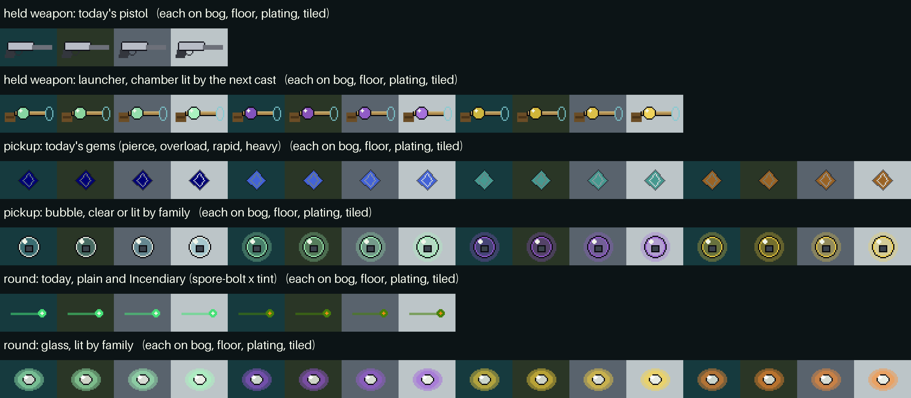

# Make the guns, mods and elements belong to Sporefall

The setting already says what the gun, the mods and the glow are. The gun is a stolen section of an essence still. A mod is the essence of one named drowned object, caught as a bubble. Essence glow is the hot colour in a muted frame. The code draws a steel semi-automatic pistol, names mods after shooter ammunition, shows them as emoji and gems, and gives 18 mods 18 hues, 16 of them off the locked palette.

Most of the fix is names, palette values and procedural drawing that the engine already does. Nothing here depends on mass-generated art. The [ranked shortlist](#4-the-five-changes-to-make-first) is the place to start. The [sketch](setting-fit/sketch.png) shows the three biggest visual changes at game size on four floors. It is a PIL mock, so it leaves out the shader halo.



## Sources, and which images count

The owner ruled that most of the art repo's images are generated and bad, so they are not a style reference. This report weighs sources in this order.

1. **Written intent.** The game's [docs/LORE.md](../LORE.md), [docs/swampspace-theme.md](../swampspace-theme.md), [INSPO.md §8 and §9](https://github.com/redaphid/sporefall-station/blob/docs/inspo/INSPO.md#8-art-direction-and-game-feel) (on the open `docs/inspo` branch, PR #82), and the art repo's written docs. The most useful art doc is [docs/LORE_CHARACTERS.md](https://github.com/redaphid/sporefall-art/blob/e5dc5ffb0bfc2df29990777014d9f4def5e65854/docs/LORE_CHARACTERS.md), which holds the visual grammar (G1 to G7) and the prompt laws (L1 to L3). The echo roster in [sprites/roster_lore.py](https://github.com/redaphid/sporefall-art/blob/e5dc5ffb0bfc2df29990777014d9f4def5e65854/sprites/roster_lore.py#L545-L730) names every echo's junk core and, for four of them, its drop. [NIGHT_LOG.md](https://github.com/redaphid/sporefall-art/blob/e5dc5ffb0bfc2df29990777014d9f4def5e65854/NIGHT_LOG.md) records what each generation batch produced and why it failed. `D:\Projects\sporefall-art\docs\LORE_GROUNDING.md` (local only, not pushed) holds the tone rules and the battery and wrench mappings. [design-C.md](loadout-exploration/design-C.md) on main already groups the mods into hue families, and this report builds on it.
2. **Curated, shipped art.** [public/themes/swampspace-hires/](../../public/themes/swampspace-hires/) and its [CURATION.md](../../public/themes/swampspace-hires/CURATION.md), the locked 34-colour palette in [scripts/assets/palette.py](../../scripts/assets/palette.py), and the contact sheets [items.png](../assets/swampspace/items.png) and [fx.png](../assets/swampspace/fx.png).
3. **The generated corpus.** It is evidence of what the art-repo pipeline can and cannot make, and nothing more. A read-only survey sampled the tree (about 40,000 files) and viewed about 35 images through contact sheets.

Two art-repo images appear in this report, both as pipeline evidence, not as a look to match.

- [setting-fit/cage-icon-at-game-size.png](setting-fit/cage-icon-at-game-size.png) is one cage from `wip/identity/310-hour2-accepted/ammo-icons/pixel_seed412.png`. NIGHT_LOG [line 414](https://github.com/redaphid/sporefall-art/blob/e5dc5ffb0bfc2df29990777014d9f4def5e65854/NIGHT_LOG.md?plain=1#L414) calls that sheet a "UI motif usable now". At 32 px the bubble still reads, and the cage bars smear into a brown mesh (observed).
- [setting-fit/weapon-batch-460.png](setting-fit/weapon-batch-460.png) is `wip/identity/460-weapon-plumbing/painterly_seed412.png`, from a prompt for a "handheld launcher built from re-plumbed brass and glass still sections". It came back as a brass gimbal instrument in a product-photo style. NIGHT_LOG [line 610](https://github.com/redaphid/sporefall-art/blob/e5dc5ffb0bfc2df29990777014d9f4def5e65854/NIGHT_LOG.md?plain=1#L610) closes the topic after three misses and files a held weapon as a "hand-direction task".

**A warning about the art repo's LORE.md.** The local working copy of `D:\Projects\sporefall-art\docs\LORE.md` is not the file on `master`. The local copy starts at section 2, carries 17 paragraphs headed "Addition:", and repeats one section ("The Essence-Echo Ritual (canon)") seven times as sections 16 to 22 (measured with `grep`). Those additions make the swamp "a thinking entity" and add sacrificial rituals. That contradicts LORE_GROUNDING ("environmental hazard, not intelligent antagonist", "no philosophical depth") and the owner's rejection of the voodoo layer (INSPO §9). The file on `master` is the clean 2026-07-23 text. I read the additions as the output of an automated lore loop that nobody committed (inferred from the `wip/lore_evolution/` folders), and I did not use them.

**Canon and proposals.** [docs/LORE.md](https://github.com/redaphid/sporefall-station/blob/b882a5bfee11f659e0d366f2129afbb73f85b44e/docs/LORE.md?plain=1#L25-L62) has two owner-approved sections, the five lore-to-mechanic ties and the arcade-pacing rules. Everything under its [line 64](https://github.com/redaphid/sporefall-station/blob/b882a5bfee11f659e0d366f2129afbb73f85b44e/docs/LORE.md?plain=1#L64) heading is a proposal marked "NOT canon". That includes the echo design rule, the hue-telegraph and "launchers are stolen stills". [INSPO §6](https://github.com/redaphid/sporefall-station/blob/docs/inspo/INSPO.md#specific-enemy-design-rules-taken-from-the-lore) lists the echo rule and the hue-telegraph as enemy design rules taken from the lore. This report says "canon" only for those two sections and names everything else a proposal.

## 1. What the art actually establishes

### Everything is plumbing

[G2](https://github.com/redaphid/sporefall-art/blob/e5dc5ffb0bfc2df29990777014d9f4def5e65854/docs/LORE_CHARACTERS.md?plain=1#L57) is the rule that matters most for weapons. "The colony's whole technology is catching, caging and decanting bubbles. Wire cages, glass jars, brass petcocks, copper coil, hose, funnels, condenser heads, net-poles, magnetic gauntlets. A weapon is a stolen section of an essence still." Canon tie #2 in [docs/LORE.md](https://github.com/redaphid/sporefall-station/blob/b882a5bfee11f659e0d366f2129afbb73f85b44e/docs/LORE.md?plain=1#L30-L31) agrees. It says "Weapons are bubble-burst plumbing, not guns", and it says combining mods is essences mixing in the chamber, so "the color-mixing shaders ARE mixed essences". The proposal "launchers are stolen stills" at [line 119](https://github.com/redaphid/sporefall-station/blob/b882a5bfee11f659e0d366f2129afbb73f85b44e/docs/LORE.md?plain=1#L119) adds that the mixing chamber is the still's heart.

Clothing follows [G1](https://github.com/redaphid/sporefall-art/blob/e5dc5ffb0bfc2df29990777014d9f4def5e65854/docs/LORE_CHARACTERS.md?plain=1#L49). It is heirloom gear re-tailored across generations, with quilted pressure-suit liners, visible stitches, visor glass reground into spectacles and mission patches for forgotten missions. "The newest thing anyone owns is fifty years old."

The weapon prompts the art docs judged right are specific. Batches 460 and 480 asked for brass pipe, a rounded glass mixing chamber, caged essence vials on a valve manifold, a soap-film hoop at the muzzle, a cord-wrapped grip and a canvas sling (the JSON beside each image in `wip/identity/460-weapon-plumbing/` and `480-weapon-held/`). NIGHT_LOG [line 605](https://github.com/redaphid/sporefall-art/blob/e5dc5ffb0bfc2df29990777014d9f4def5e65854/NIGHT_LOG.md?plain=1#L605) calls that vocabulary right and the images wrong.

### One hot light in a muted world

[G3](https://github.com/redaphid/sporefall-art/blob/e5dc5ffb0bfc2df29990777014d9f4def5e65854/docs/LORE_CHARACTERS.md?plain=1#L63) sets teal mist, olive overgrowth, tan and grey decayed tech, station white gone yellow, swamp charcoal and bone. "Essence glow is the only saturated colour in the frame. One bubble, one lamp, one core, in a single hue. Hue telegraphs what a thing drops (proposed HUE-TELEGRAPH). Two competing glows is one too many." Roster 2 later [amended G3](https://github.com/redaphid/sporefall-art/blob/e5dc5ffb0bfc2df29990777014d9f4def5e65854/docs/LORE_CHARACTERS.md?plain=1#L286) so it governs the lit scene and not costumes. G3 is an art-repo rule. It pulls against canon tie #2, which says rounds mix colours, and [section 5](#5-open-questions-for-the-owner) asks the owner to settle that.

The shipped pack makes the palette exact. [palette.py](../../scripts/assets/palette.py) locks 34 colours derived from Flashback's Titan jungle ([swampspace-theme.md](../swampspace-theme.md)). Seven of them are the hot accents, marked "use sparingly". They are bio green `#46e078`, pale bio `#a6ffbe`, bio teal `#3ce0d8`, yellow `#ffd83e`, ember `#ff9032`, red `#e04a2a` and violet `#a05ae0`. Bone white `#f2f6ea` is an eighth near-accent. The game therefore has about eight glow hues to spend.

### Bubbles around one junk core

[G6](https://github.com/redaphid/sporefall-art/blob/e5dc5ffb0bfc2df29990777014d9f4def5e65854/docs/LORE_CHARACTERS.md?plain=1#L81) is the art repo's one enemy rule, and the game's echo design rule proposal says the same. An essence-echo is a translucent cluster of bubbles around one opaque junk core. Shots pop the outer bubbles, and the core bursts last and falls as the mod drop. [G7](https://github.com/redaphid/sporefall-art/blob/e5dc5ffb0bfc2df29990777014d9f4def5e65854/docs/LORE_CHARACTERS.md?plain=1#L87) puts the core where the object naturally sits, such as a collar at the throat, a wrench in a hand or a boot on a foot.

The roster turns that into data. Every echo in [roster_lore.py](https://github.com/redaphid/sporefall-art/blob/e5dc5ffb0bfc2df29990777014d9f4def5e65854/sprites/roster_lore.py#L545-L730) has a `core`, and four name their drop. An attitude thruster drops knockback, a mirror shard drops split shot, a papery nodule drops seeker swarm and a battery cell drops electricity. The other cores are a dog collar, a wedding ring, a brass tap, a pipe wrench, a work boot, a keyring, a camera lens, a belt buckle, a work glove, a pressure helmet, an alarm klaxon, spectacles, a child's wire rattle, a mooring cleat, a tally slate, a brass petcock and a payday token. LORE_GROUNDING adds "Battery essence = electricity mod", "Wrench essence = weight/knockback mod" and "Organic matter = healing, decay effects".

The other families give more vocabulary. Swamp fauna eat bubbles and have "bladders that inflate" ([§5B](https://github.com/redaphid/sporefall-art/blob/e5dc5ffb0bfc2df29990777014d9f4def5e65854/docs/LORE_CHARACTERS.md?plain=1#L158)). Spore-warped colonists are still on shift while fungus takes the shoulder ([§5C](https://github.com/redaphid/sporefall-art/blob/e5dc5ffb0bfc2df29990777014d9f4def5e65854/docs/LORE_CHARACTERS.md?plain=1#L170)). Drowned machinery is "purpose without a purpose", with "one status LED as the hot accent" ([§5D](https://github.com/redaphid/sporefall-art/blob/e5dc5ffb0bfc2df29990777014d9f4def5e65854/docs/LORE_CHARACTERS.md?plain=1#L183)). Roster 2 adds a Dry Choir of bleached bone and salt and a Sodium Watch of emergency lamps ([§8.2](https://github.com/redaphid/sporefall-art/blob/e5dc5ffb0bfc2df29990777014d9f4def5e65854/docs/LORE_CHARACTERS.md?plain=1#L292)).

### Recurring motifs

- **The caged bubble.** It is the ammo-icon set, the succession locket, the dry wall of caged essences, and the sapper's "caged bubble of distilled blast essence" in [npcs.ts](../../src/game/data/npcs.ts#L321).
- **The still.** It is the batch 300 environment (NIGHT_LOG [line 403](https://github.com/redaphid/sporefall-art/blob/e5dc5ffb0bfc2df29990777014d9f4def5e65854/NIGHT_LOG.md?plain=1#L403)) and the weapon fiction.
- **The five-word flavour line.** A canon-approved section of LORE.md says rare pickups carry one line, such as "essence of: someone's wedding ring" ([line 59](https://github.com/redaphid/sporefall-station/blob/b882a5bfee11f659e0d366f2129afbb73f85b44e/docs/LORE.md?plain=1#L59)). Two proposed flavour banks at [line 80](https://github.com/redaphid/sporefall-station/blob/b882a5bfee11f659e0d366f2129afbb73f85b44e/docs/LORE.md?plain=1#L80) and [line 100](https://github.com/redaphid/sporefall-station/blob/b882a5bfee11f659e0d366f2129afbb73f85b44e/docs/LORE.md?plain=1#L100) hold twelve lines.
- **The teal stain.** Bare essence stains skin teal, and the depth of the stain is seniority ([G4](https://github.com/redaphid/sporefall-art/blob/e5dc5ffb0bfc2df29990777014d9f4def5e65854/docs/LORE_CHARACTERS.md?plain=1#L71)).
- **The sporefall.** Falling teal motes are the swamp's exhale (proposed, [LORE.md line 108](https://github.com/redaphid/sporefall-station/blob/b882a5bfee11f659e0d366f2129afbb73f85b44e/docs/LORE.md?plain=1#L108)).

### The test the art docs apply

[§0](https://github.com/redaphid/sporefall-art/blob/e5dc5ffb0bfc2df29990777014d9f4def5e65854/docs/LORE_CHARACTERS.md?plain=1#L15) calls the green bog-mutant brute a "fantasy ogre that happens to be damp" and sets one test for every roster entry. "Could this exist in any other swamp?" This report applies the same test to the gun, the mods and the elements. It asks whether the thing could exist in any other shooter.

## 2. Where the guns, mods and elements break the setting today

Each item names the file that makes the break and the rule it breaks.

1. **The one weapon every player holds all run is an Earth handgun.** `case 'gun'` in [src/render/art.ts](../../src/render/art.ts#L1343) draws a "Semi-auto PISTOL" with a steel slide `0xb8bcc6`, slide serrations, a rear sight and a trigger guard. [WEAPONS.pistol](../../src/game/data/items.ts#L81) is named "Pistol", and the touch fire button shows that name ([touchLabels.ts](../../src/input/touchLabels.ts#L46)). The curated item sprite `spore-pistol` in [items.png](../assets/swampspace/items.png) is a sci-fi handgun too. Under the one-weapon rule (PR #53) this is the object on screen for the whole run, and it breaks canon tie #2. Every ranged weapon shares the `gun` silhouette ([weaponArt.ts](../../src/render/weaponArt.ts)), so the drowned diver in [npcs.ts line 276](../../src/game/data/npcs.ts#L276), described as carrying "a harpoon gun", holds the same semi-automatic.
2. **Mod names are shooter vocabulary.** [MODS](../../src/game/data/mods.ts#L82) has Overload, Barrage, Rapid Fire, Heavy Rounds, Choke, Hot Loads, Glass Cannon, Cryo Rounds, Incendiary, Tesla Rounds, Bouncy, Piercing, Homing, Explosive, Splinter, Splinter Shot, Vampiric and Detonator. None passes the "any other shooter" test. "Rounds" and "Loads" name ammunition, and ammunition was removed (PR #8). "Tesla" imports Earth history and "Vampiric" imports fantasy. The blurbs keep the same words ("Bullets ricochet off walls", "recoil"). Canon tie #1 already supplies the pattern for the fix (mirror to split shot, hornet nest to seeker swarm, thruster to knockback).
3. **Icons are emoji.** Every mod's `icon` is an emoji (💥 🔱 ⚡ 🪨 🎯 🚀 🔮 ❄️ 🔥 🌩️ 🪃 🏹 🧲 💣 ✳️ 🔪 🩸 ☠️). The draft card shows it at 56 px ([draftScreen.ts line 143](../../src/ui/draftScreen.ts#L143)). The hotbar, the sequence strip, the inspect card and the loadout panel show it too ([hotbarModel.ts](../../src/ui/hotbarModel.ts#L15), [sequenceStrip.ts](../../src/ui/sequenceStrip.ts#L60), [inspectModel.ts](../../src/ui/inspectModel.ts#L99), [loadoutPanel.ts](../../src/ui/loadoutPanel.ts#L60)), and [loadoutModel.ts](../../src/ui/loadoutModel.ts#L138-L148) hard-codes nine more behaviour badges. The OS font draws emoji, so they sit outside the palette and change look between Android and desktop. Several import other fictions (a bow, a boomerang, a trident, a crystal ball). One is a legibility bug. Rapid Fire uses ⚡ and Tesla Rounds uses 🌩️, so a kid reads the fire-rate mod as the lightning mod.
4. **The pickup is a fantasy gem.** The `mod.` branch at [art.ts line 960](../../src/render/art.ts#L960) draws a flat diamond with a highlight stroke. The echo design rule proposal says a mod is a caught bubble that falls out of an echo's core. A gem is loot from a dungeon.
5. **Eighteen hues where the palette has about eight.** [MOD_PICKUP_COLORS](../../src/render/modColors.ts#L23) gives each of the 18 mods its own glasbey-style hue, and that hue tints the gem, the held gun and the core of every modded round. [hue-check.py](setting-fit/hue-check.py) measures the live values against the pack. Its floor set includes `tiled`, the pale deck of the indoor complexes on floor 3 and deeper ([CURATION.md](../../public/themes/swampspace-hires/CURATION.md)).
    - 16 of the 18 mod colours sit 12 or more CIE76 units from every palette entry. Only Incendiary (`#f58231`, 6.6 from ember) and Bouncy (`#aaffc3`, 3.0 from pale bio) belong to the pack (measured).
    - 15 of the 18 have almost the same lightness as at least one floor (a lightness gap under 15 L\*). Piercing (navy `#000075`) is 3.6 L\* from `street`, and Vampiric is 3.4 from `bog`. Frost is 0.0 from `tiled` (measured). A same-lightness gem is the "pickup: today" row of the sketch.
    - Eighteen hues also make the proposed hue-telegraph impossible. Nobody learns eighteen colours, and the palette has seven hot accents.
6. **In the default theme, every modded round is a shade of green.** Both shipped packs draw a round as `fx/spore-bolt.png`, a palette-exact bio-green bolt. [bullets.ts](../../src/render/bullets.ts#L132) tints that sprite with the composed colour, and Pixi's tint multiplies, so the green body swallows the hue. [round-colours.mts](setting-fit/round-colours.mts) runs the live `composeBulletTraits` for every single mod and multiplies by the sprite's body pixel. An Incendiary core comes out olive `#46800b`, Explosive dark olive `#464c1f` and Vampiric near black `#353304` (computed, not a screenshot). 8 of the 18 single-mod rounds have no halo, so that green shade is their only colour. The Nova Drift idea, that a round looks like what it is made of, reaches the player mainly through the halo. The gold tracer `BASE_BULLET_COLOR` shows only in a theme with no projectile art.
7. **The elements are the ones every game has.** [ELEMENTS](../../src/game/data/elements.ts) has burning, frozen, wet, electrified, poisoned and spore. Only spore is native to a bog, and no mod carries it. Issue #123 already asks to replace the rest. The element mods are named like military ammunition (Cryo Rounds, Incendiary, Tesla Rounds).
8. **The held gun hides the order that sequencing makes matter.** [composeWeaponSkin](../../src/render/weaponSkin.ts#L58) blends every mod's colour in sorted-id order. Sequenced casting makes order the mechanic, and a cast carries one element ([modSequence.ts](../../src/game/systems/modSequence.ts)). The gun in hand shows a blend of the whole list, not what fires next. PR #118 notes the same gap from the correctness side.
9. **The draft card is generic loot UI.** [draftScreen.ts](../../src/ui/draftScreen.ts#L18) uses grey, blue and orange rarity borders, a navy gradient, `system-ui` and the line "take one mod for your gun" ([line 120](../../src/ui/draftScreen.ts#L120)). Canon tie #5 says the protagonist wears the system, with "bandolier/locket-cage sprites = ammo UI" ([LORE.md line 38](https://github.com/redaphid/sporefall-station/blob/b882a5bfee11f659e0d366f2129afbb73f85b44e/docs/LORE.md?plain=1#L38)).
10. **Sound is arcade.** The mod pickup is a two-step triangle chirp ([sound.ts line 49](../../src/render/sound.ts#L49)). A hit is a square blip. Nothing pops.
11. **Mods lie on room floors instead of falling out of echoes.** [scatterModPickups](../../src/game/populate.ts#L931) places mods in rooms at populate time. The echo design rule proposal says the core falls as the drop. This break costs a sim change to fix, so it sits lower in the ranking.

Some of it already fits. The Nova Drift composition in [bulletVisuals.ts](../../src/render/bulletVisuals.ts) is the right machine for essence colour. It needs a paler sprite under it and palette inputs, not a rewrite. The held weapon, the gem and the status looks are procedural, so redrawing them costs code, not art. The newer NPCs in [npcs.ts](../../src/game/data/npcs.ts#L270) are written in the setting's own terms. [design-C.md](https://github.com/redaphid/sporefall-station/blob/b882a5bfee11f659e0d366f2129afbb73f85b44e/docs/design/loadout-exploration/design-C.md?plain=1#L113-L124) groups the 18 mods into six hue families, and PR #111 (draft) prototypes mods as bubbles you can vent and shoot through.

## 3. Proposals

Each proposal gives the setting hook, what changes for the player, the smallest implementation, and whether it needs new art. The art calls rest on these facts.

- The art-repo pipeline failed three times at held weapons (NIGHT_LOG [line 610](https://github.com/redaphid/sporefall-art/blob/e5dc5ffb0bfc2df29990777014d9f4def5e65854/NIGHT_LOG.md?plain=1#L610)).
- Its multi-stage FX strips failed every time (NIGHT_LOG [line 522](https://github.com/redaphid/sporefall-art/blob/e5dc5ffb0bfc2df29990777014d9f4def5e65854/NIGHT_LOG.md?plain=1#L522)). Its marbled two-colour bubble icons failed in pixel style ("intra-object color mixing doesn't parse", [line 475](https://github.com/redaphid/sporefall-art/blob/e5dc5ffb0bfc2df29990777014d9f4def5e65854/NIGHT_LOG.md?plain=1#L475)), and the painterly retry, which the log calls "STUNNING", reads as a product photo of a glass globe (observed, [line 515](https://github.com/redaphid/sporefall-art/blob/e5dc5ffb0bfc2df29990777014d9f4def5e65854/NIGHT_LOG.md?plain=1#L515)). The fix the night log chose was "white sprite + existing engine shader tint" ([line 509](https://github.com/redaphid/sporefall-art/blob/e5dc5ffb0bfc2df29990777014d9f4def5e65854/NIGHT_LOG.md?plain=1#L509)).
- Its "pixel art" is not pixel art. The ammo-icon sheet has 211,490 distinct colours (measured) and needs a k-centroid and palette-lock pass before it can ship.
- The game repo's own pack pipeline did better with curation. It shipped 8 items at about 9% acceptance, including a readable `phosphor-flask` ([items.png](../assets/swampspace/items.png)). One sweep failed because environment references "turned weapons into mushrooms" ([CURATION.md](../../public/themes/swampspace-hires/CURATION.md)).

So the safe routes are procedural drawing, engine tint on one pale master, and a few hand-drawn or hand-curated pieces. Every proposal below uses one of those.

### 3.1 Weapons as swamp-station salvage

**The launcher replaces the pistol.**

- *Hook.* Canon tie #2, G2, and the "launchers are stolen stills" proposal. The batch 460 prompt already describes the object.
- *For the player.* The weapon in your hand becomes a short brass pipe with a round glass chamber over the grip and a soap-film hoop at the muzzle. The chamber glows the hue of the cast that fires next, so you read your sequence from your own hand. When the sequence wraps, the chamber empties and refills during the recharge. The fire button reads "Launcher".
- *Smallest implementation.* Rewrite `case 'gun'` in [art.ts](../../src/render/art.ts#L1343), about 40 lines of `Graphics`, in palette brass (`#6b4d26`, `#b08d50`, `#cbb277`) and glass (`#7ecbd2`). Draw the chamber as a second texture, and give each held-weapon view in `sprites.ts` a child sprite for it, so the renderer can tint it every frame. On main today a "next cast" exists only under the `sequencedMods` flag, and [sequenceModel.ts](../../src/ui/sequenceModel.ts) computes it only for the local player. Until sequencing is the only mode, tint the chamber with the composed round colour, and tint other players' chambers the same way. Rename `WEAPONS.pistol.name` to "Launcher". That changes the touch button label and five test files that assert "Pistol" (`touchLabels.test.ts`, `touchLabels.adversarial.test.ts`, `loadoutModel.test.ts`, `inspectModel.test.ts`, `sequenceStrip.test.ts`) plus `e2e/weapon-combos.mjs`. The sketch's launcher row is a 44 by 18 px draft of the shape.
- *Who else holds it.* Every NPC with `weapon: 'pistol'` (the Rootcult Enforcer, the Drowned Diver and the Tide Bellwether) gets the launcher too. That fits the fiction, because stills are the colony's weapons. To give the drowned diver its harpoon gun, add a separate `WEAPONS` id and a `harpoon` shape in [weaponArt.ts](../../src/render/weaponArt.ts).
- *New art.* None. Do not generate it, because held weapons are a three-strike failure.

**Each weapon's silhouette shows its sequence shape.** PR #78 gave each weapon a different sequence shape (`slots`, `castsPerTrigger`, `rechargeOnWrap`). Draw that difference as plumbing. The shotgun (two casts per trigger) becomes a manifold with twin chambers and a flared funnel. The machine gun (six slots, long recharge) becomes a coil still with copper coil. This matters mostly for NPCs, because the player holds one weapon.

**Grown things arrive as YOU cards, not as new weapons.** The one-weapon rule stands. The spore-warped family gives the hook for grown weapons, "a mycelial cuff where a glove used to be" ([§5C](https://github.com/redaphid/sporefall-art/blob/e5dc5ffb0bfc2df29990777014d9f4def5e65854/docs/LORE_CHARACTERS.md?plain=1#L170)). A YOU card such as "Bracket graft" can grow a fungus onto the launcher and change how it handles, without adding a second weapon. See [3.5](#35-draft-cards-and-the-hud-as-in-world-objects) for how YOU cards should look.

### 3.2 Mods as essences

**Name each mod after the object it is the essence of.**

- *Hook.* Canon tie #1. Every mod is the essence of a specific object, drops are "what sank here", and new mods imply new objects.
- *For the player.* The draft card, the inspect card and the loadout panel show the object in large type ("Mirror") with a small caption ("essence of a cracked mirror"). The hotbar shows only icons, so it does not change. Rare and legendary cards add one five-word flavour line, as the canon-approved section of LORE.md asks. Rewrite the blurbs to say "shots" where they say "bullets" or "rounds", and keep what each blurb says the mod does.
- *Smallest implementation.* Change `name` and `blurb` in [mods.ts](../../src/game/data/mods.ts#L82) and add an optional `essenceOf` string. Mod ids do not change, and no fixture, snapshot or wire field carries a name, so saves and replays are untouched. Rename the behaviour-badge labels in [loadoutModel.ts](../../src/ui/loadoutModel.ts#L138-L148) (for example "Homing") to match. Update the strings in `modEffect.test.ts`, `truthfulMods.test.ts`, `elementOverride.test.ts`, `inspectModel.test.ts`, `loadoutTruth.test.ts`, `elementPriority.test.ts`, `e2e/weapon-combos.mjs`, `e2e/weapon-combos-readme.mjs` and `e2e/feature-mod-pickup.mjs`. Add one release note.
- *New art.* None.

The table maps every current mod to an object. It prefers objects that canon or the echo roster already name, and it takes flavour lines from the two proposed banks in LORE.md where one fits. The last column is design-C's hue family for the mod. These are proposals for the owner to cut or change.

| Mod id | Today | Proposed name | Essence of | Why this object | Flavour line (rare and legendary) | design-C family |
|---|---|---|---|---|---|---|
| `heavy` | Heavy Rounds | Thruster | an attitude thruster | Canon tie #1 (thruster to knockback), roster `thruster-echo` | none (common) | Weight |
| `split` | Splinter | Mirror | a cracked mirror | Canon tie #1 (mirror to split shot), roster `mirror-echo` | "the colonist who was two" | Mirror |
| `homing` | Homing | Hornet Nest | a hornet nest | Canon tie #1 (seeker swarm), roster `nest-echo` | "a nest in the vents" | Flight |
| `shock` | Tesla Rounds | Battery | a battery cell | The founding example in LORE.md, roster `cell-echo` | "the last charged cell" | Storm |
| `overload` | Overload | Wrench | a pipe wrench | Roster `grip-echo`. LORE_GROUNDING says wrench is "weight/knockback", but canon gives knockback to the thruster, so the wrench keeps weight | "a wrench still gripped" | Weight |
| `bulk` | Barrage | Keyring | a ring of station keys | Roster `key-throat`. Many small keys give more, softer shots | none (common) | Mirror |
| `choke` | Choke | Valve | a brass petcock valve | G2, roster `petcock-echo`. A valve narrows the flow | none (common) | Flight |
| `velocity` | Hot Loads | Shuttle | the last shuttle out | Flavour bank I | none (common) | Flight |
| `glassCannon` | Glass Cannon | Real Gravity | thirty seconds of real gravity | Flavour bank II. Huge, slow, legendary | "thirty seconds of real gravity" | Weight |
| `bounce` | Bouncy | Rattle | a child's wire rattle | Roster `rattle-echo`, flavour bank II | "a lullaby in the wrong language" | Flight |
| `pierce` | Piercing | Harpoon | a security diver's harpoon | The drowned diver's harpoon gun in [npcs.ts](../../src/game/data/npcs.ts#L276). It goes through | none (common) | Flight |
| `explosive` | Explosive | Bladder | a swamp-gas bladder | Fauna "bladders that inflate" (§5B) | "a bladder fit to burst" | Weight |
| `splinterShot` | Splinter Shot | Sample Jar | a mycologist's sample jar | G2 glass jars, and the Mycologist NPC's sample tube | "a sample never sent" | Mirror |
| `lifesteal` | Vampiric | Leech | the medic's leeches | LORE_GROUNDING ("organic matter = healing") | "the medic's leeches, still hungry" | Weight |
| `detonator` | Detonator | Airlock | a door that never sealed | Flavour bank I. The dead blow out like a breach | "a door that never sealed" | Weight |
| `rapid` | Rapid Fire | Needle | a liner-stitcher's needle | G1 (liners resewn for generations). A needle goes in and out fast | none (common) | Weight |
| `frost` | Cryo Rounds | See 3.3 | a cold-store seal | Only if frost survives #123 | | Cold |
| `incendiary` | Incendiary | See 3.3 | a sodium flare | Only if fire survives #123. Sodium Watch family | | Flame |

The flavour lines that are in neither bank (for example "a nest in the vents") are mine. They follow the canon form of five words or fewer after "essence of". design-C writes one flavour line per family. Object names and family lines do not conflict, because a card can show both.

**The pickup is a bubble around a dark core.**

- *Hook.* G6 and G7, the echo design rule proposal, and the hue-telegraph proposal.
- *For the player.* Mods on the floor stop being gems. Each is a glass bubble that bobs upward slightly, with a small opaque core inside and a glow in its family hue. Walking into it pops it. The sketch's "pickup: bubble" row shows one clear and three lit. The ink rim keeps it readable on the pale `tiled` deck, and the glow keeps it readable on the dark floors.
- *Smallest implementation.* Replace the diamond at [art.ts line 960](../../src/render/art.ts#L960) with a circle at low alpha, an ink rim, a highlight dot and a small dark core, about 15 lines. The core can start as one generic shape. Later it can be the object glyph from the next proposal.
- *New art.* None to start.

**Replace emoji with object glyphs inside a cage ring.**

- *Hook.* The caged-bubble motif, and canon tie #5 (the ammo UI is the locket cage).
- *For the player.* Every place that shows a mod shows the same small glyph. It is the core object's silhouette in a thin brass ring, tinted by family hue. The ⚡ and 🌩️ mix-up goes away, because a needle and a battery do not look alike.
- *Smallest implementation.* Write one `modGlyph(id)` function in `src/ui` that returns an inline SVG string, keyed by mod id. Keep it out of `DraftCard` in [draft.ts](../../src/game/systems/draft.ts), which is sim code, and look the glyph up by id in the UI. The hotbar already renders through `innerHTML` ([hud.ts](../../src/ui/hud.ts#L81)). The draft card ([draftScreen.ts line 143](../../src/ui/draftScreen.ts#L143)), the toast in `screens.ts` and the inspect rows in `overlay.ts` set `textContent`, so each needs a small element for the glyph. Replace the nine badge emoji in [loadoutModel.ts](../../src/ui/loadoutModel.ts#L138-L148) in the same change. Then delete `icon` from `ModDef`, so no caller keeps an emoji.
- *New art.* Yes. It is eighteen one-colour silhouettes at 16 to 24 px (thruster, mirror, nest, battery, wrench, keys, valve, shuttle, weight, rattle, harpoon, bladder, jar, leeches, hatch, needle, and two for the elements). Draw them by hand as SVG paths, or run them through the pack's curated item pipeline, which shipped a readable flask at this size. Do not use the art-repo pipeline. At 32 px the cage bars of its best icon smear into mesh ([cage-icon-at-game-size.png](setting-fit/cage-icon-at-game-size.png)). This is the one proposal in the report with a real art cost, which is why it sits outside the top five.

**Put the mod inside an echo, so the hue telegraphs the drop.** The hue-telegraph proposal says an echo glows the hue of what it drops. Today mods lie on room floors ([scatterModPickups](../../src/game/populate.ts#L931)). The sim has no "echo" flag, so first decide which archetypes count as echoes. `scatterModPickups` runs before `spawnEncounters` in [populate.ts](../../src/game/populate.ts#L124-L128), so the call moves after it. Both use their own named RNG forks, so the reorder does not shift other streams. Keep the same `mod-pickups` fork and the same choice of mod. If the room holds an echo, give that NPC an optional `core: modId` instead of placing a pickup. The renderer tints its glow, and on death the core drops as the bubble pickup. Rooms with no echo keep the floor pickup. This changes where mods appear and adds one optional entity field, so it needs the owner's approval and re-pinned golden fixtures. PR #111 left "cored echoes and the hue glow" out of its slice.

### 3.3 New elements rooted in the setting (for issue #123)

Every candidate has a one-line verb, a best and a worst matchup against the current roster, a modifier combo, a line two kids would say, and a hook in the art or the lore. The matchups use the hi-res manifest's display names and the behaviour comments in [npcs.ts](../../src/game/data/npcs.ts). Each is a guess until the arena census (PR #121) measures it. Four candidates are issue #123's own starter prompts renamed for the setting: Moor is Gravity or Anchor, Short is Silence, Root is Bloom, and Last Order is Charm or Hijack.

| Element | Verb, in one line | Best against | Worst against | Combo with a modifier | Two kids say | Setting hook | Glow |
|---|---|---|---|---|---|---|---|
| **Cage** | Traps the target in a bubble so it cannot move or act, and the hit that pops it lands very hard. | Carapace Brute, Bog Mutant | Gloam Hound packs and Spore Mite swarms (it holds one body) | Keyring cages several | "Cage it, you pop it" | G2. Caging bubbles is the colony's whole technology | pale bio `#a6ffbe` |
| **Moor** | Hauls every body near the hit toward the hit point. It moves them and does not hold them. | Gloam Hounds (it collapses their encircling ring), Spore Mite swarms | A lone target (nothing near to haul) | Bladder into the pile | "Moor them, I'll blow the pile" | Roster `cleat-echo` (a mooring cleat trailing a bubble mooring line), the catch-jetty | teal `#3ce0d8` |
| **Short** | Kills the target's lights, so it cannot raise the alarm, rally, heal, plant a charge or howl up its pack. | Tide Bellwether, Bog Mender, Blast Diver, Gloam Hound, anything that raises the alarm (#101) | Carapace Brute, Cinder Husk (no orders or abilities) | Harpoon shorts a whole line | "Short the bell before it rings" | Drowned machinery's one status LED (§5D), the brownout floor modifier | violet `#a05ae0`, then the target goes grey |
| **Root** | Where the round lands, a fungal wall grows for a few seconds and blocks bodies and rounds. | Drowned Diver raids firing down a corridor, a doorway | Spore Mortar (lobs over walls) | Rattle turns the wall into a ricochet bank | "Wall the door, I'll flank" | Spore-warped, "some of it took root" (§5C) | bio green `#46e078` |
| **Last Order** | The target attacks the next thing you hit. | Raids and packs, where one turns on its own | A lone target (nothing to point it at) | Mirror splits, so two turn | "I tag it, you point it" | Drowned machinery "still executing the last instruction it received" | shares red with Weight |
| **Bait** | Stains the target with essence, so fauna and nearby echoes turn on it. | Mixed rooms where hounds or mites share space with a raid | A room of one creature | Keyring baits several | "Bait the mender, the hounds do the rest" | G4's teal stain, and fauna that eat essence (§5B) | shares teal with Moor |
| **Recall** | The target forgets you and walks back to its post. | A Blast Diver mid-breach, a raid mid-charge | Brood Sacs and Hive Spires (already home), Gloom Lurkers (home is an ambush corner) | Rattle round a corner | "Recall the sapper, I'll get the door" | The Recall Drone proposal ([LORE.md line 71](https://github.com/redaphid/sporefall-station/blob/b882a5bfee11f659e0d366f2129afbb73f85b44e/docs/LORE.md?plain=1#L71)), "nobody rescinded the order" | shares violet with Short |
| **Dry** | Salts the ground where it lands, so spore and bog water die there for a while. | Hive Spire (it spreads), spore-flooded rooms, bog-tide floors | A dry room with no spore or bog water | Keyring salts a room | "Salt the floor, then stand on it" | The Dry Choir's salt and bone (§8.2), desiccant stores (§8.1), the dry wall | bone `#f2f6ea` |
| **Distil** | What dies under it leaves its essence hanging in the air, and rounds fired through it take that power for a few seconds. | Crowds of mixed echoes | A single boss (one death) | Needs PR #111's shoot-through rule | "Kill it in front of me" | Canon tie #3, death dissolves you back into essences | the dead body's family hue |

**How each would be built.** Cage, Short, Last Order, Bait and Recall are statuses in the [ELEMENTS](../../src/game/data/elements.ts) table with a verb in the systems that read them, the way #92 built panic and jump. Cage is frozen's verb (immobilize, then shatter on impact) with a new name and a bubble look. Keep it only if the owner wants a hold in the set. Moor is a displacement like knockback, so it stays outside the control lockout in `statusFx.ts`, which today covers frozen, electrified and panic. Short is not an immobilize either, but the owner should rule on whether it counts as control. Root spawns a temporary blocking entity and Distil spawns a lingering field, so neither fits the `onHit: StatusApply` shape, and both need a new area effect like the grenade's `onLand`. Distil also depends on PR #111, which is a draft marked "do not merge". Recall repeats Spore's outcome ("loses you") by memory instead of sight. None needs generated art. Each look is a status shader effect or a procedural object (see 3.4).

**Spore is a narrow gun element.** It exists in `ELEMENTS`, and #92 gave it the blind verb, but no mod carries it. Ten archetypes in [npcs.ts](../../src/game/data/npcs.ts) have `spore: 0`, and `sporeBlinded` in [goals.ts](../../src/game/systems/goals.ts#L75) does nothing to them. They include the Mireclaw Alpha, Derelict Units, Spore Mites, Gloam Hounds, the Bog Mender and the Spore Mortar. Spore is better as a world hazard than as a gun element.

INSPO's ruling 2 says "four elements with six distinct pairs beats eight elements with twenty-eight mushy ones". My recommended four are **Cage, Moor, Short and Root**. Cage holds one body, Moor moves many, Short takes away orders, and Root changes the ground. Only Cage is a control verb, so no pair fights the lockout. The pairs are easy to say mid-fight. "Moor the pack against the root wall." "Short the bellwether, then cage the sapper." Each also gets its own palette accent. If the owner drops the hold, Last Order takes Cage's place.

Under that set, fire, ice and lightning leave the gun. Fire stays in the world through barrels and ignite objects, which already exist outside the mod table ([items.ts](../../src/game/data/items.ts), comment on `AreaEffect`). Wet stays as a room state for bog tide, not as a gun element.

### 3.4 The bullet and status look, using the palette

**A pale glass round, so the essence colour shows.**

- *Hook.* G6 ("shots pop the outer bubbles") and the night log's "white sprite + existing engine shader tint".
- *For the player.* A round is a small pale bubble (bone `#f2f6ea` over glass `#7ecbd2`) with a one-pixel ink rim and a highlight dot. Tinted, it shows the real composed colour. A fire round reads ember instead of olive. It is the sketch's "round: glass" row.
- *Smallest implementation.* Redraw `fx/spore-bolt.png` in both swampspace packs with the pack's `procedural.py`, which already draws all eleven FX sprites. Keep the green bolt for NPC rounds, so enemy fire stays distinct from a player's build (the rule in the header of [bullets.ts](../../src/render/bullets.ts)). That needs a second themed key, or a tint for NPC rounds.
- *Proof.* Rerun [round-colours.mts](setting-fit/round-colours.mts) with the new sprite. Its "core on screen" column should match the "composed" column.
- *New art.* None. The sprite is procedural.

**Colour by family, from the palette.**

- *Hook.* G3's sparse hot accents, the hue-telegraph proposal, and design-C's R1, which already answers how 18 mods share a few hues ("Hue gives the family, not the member").
- *For the player.* Pickups, rounds, the launcher's chamber and the glyphs use six family hues instead of eighteen mod hues. Rounds still mix colours when a cast holds several families, which keeps canon tie #2's "the color-mixing shaders ARE mixed essences".
- *Smallest implementation.* Snap design-C's families to the nearest palette accents. Storm is violet `#a05ae0`, Cold is pale bio `#a6ffbe`, Flame is ember `#ff9032`, Mirror is bone `#f2f6ea`, Flight is yellow `#ffd83e` and Weight is red `#e04a2a`. Two snaps move furthest. design-C's Cold is pale blue, and the palette has no hot blue, so it becomes mint. Its Weight is rust, which becomes red. Replace the 18 entries of [MOD_PICKUP_COLORS](../../src/render/modColors.ts#L23) with a family lookup. `modColors.test.ts` changes its contract from "a distinct colour per mod" to "a distinct palette colour per family". `bulletVisuals.test.ts` and `weaponSkin.test.ts` assertions that name a mod's exact colour change with it. Delete `SAT_BOOST`, which pushes blends off the palette. If #123 replaces the elements, the new elements take the element slots (see the Glow column in 3.3).
- *Every pickup and round is two-tone.* [hue-check.py](setting-fit/hue-check.py) measures the proposed colours by the same rules as today's. All eleven sit on the palette. Nine of them still share their lightness with at least one floor, because the floors run from L\* 15 (`street`) to L\* 79 (`tiled`) (measured). No single fill reads on every floor. The ink rim reads on the pale floors, and the bright fill and halo read on the dark ones, so draw both.
- *New art.* None.

**A hit is a pop.** Make the hit FX a small ring that expands and breaks. `fx/spore-burst-2.png` in the pack is already a ring. When the new elements land, give each one a look in the existing single-mesh [statusShaders.ts](../../src/render/statusShaders.ts) by adding an effect index. Cage is a bubble shell around the body. Moor is taut lines to the pull point. Short is the body's colour draining with one blinking dot that stops. Dry is white salt flecks on the ground. Every one of these marks a status in play, so none is decoration (INSPO §8). None needs art, and animated FX should not be generated, because every strip attempt failed.

### 3.5 Draft cards and the HUD as in-world objects

**The sequence strip becomes the rack of cages.**

- *Hook.* Canon tie #5, "Protagonist wears the system", with the locket cage as ammo UI.
- *For the player.* Each slot in [sequenceStrip.ts](../../src/ui/sequenceStrip.ts) is a small wire cage holding its essence glyph. The next cast's cage glows, a spent cage goes dark, and during the wrap recharge the cages refill one by one. The rack reads as the thing on the diver's bandolier, not as a toolbar.
- *Smallest implementation.* CSS and the `modGlyph` SVG from 3.2, a circle with a brass border and three bar lines.
- *New art.* None beyond the glyphs.

**Essence cards look like caught essences, and YOU cards look like heirlooms.** The floor draft will offer two kinds of card. A player should tell them apart at a glance, before reading a word.

- An essence card is a caged bubble with a paper tag. It shows the glyph glowing in its family hue, the object name, the "essence of" caption, the blurb and, for rare and legendary cards, the flavour line. Rarity becomes the cage material (bent wire, brass, a sealed glass jar) instead of grey, blue and orange borders.
- A YOU card is a stitched cloth patch, from G1's mission patches and quilted liners, with no glow at all. Names can come from G1, G4 and the succession locket, such as "Line-mother's stain", "Grandmother's liner" or "Stripe-painter's hand". These are example names, not trait designs.
- The title "take one mod for your gun" becomes "Take one essence for your launcher". "Catch" would be the setting's verb, but "catch" is also PR #111's pick-up action and close to the Cage element, so keep it out of the UI.
- The smallest implementation is CSS in [draftScreen.ts](../../src/ui/draftScreen.ts). The market-stall sheet from batch 310 (NIGHT_LOG [line 414](https://github.com/redaphid/sporefall-art/blob/e5dc5ffb0bfc2df29990777014d9f4def5e65854/NIGHT_LOG.md?plain=1#L414)) is a possible backdrop, but it would need curation and a palette pass. The card works without it.

### 3.6 Sound and feel

The art docs say almost nothing about sound. The only sound word in them is "pop" (G6). Everything below is inferred from the materials, and every sound stays in the zero-asset synth in [sound.ts](../../src/render/sound.ts).

- **A hit on an echo** is a pop, a sine that falls from about 900 Hz to 300 Hz over 40 ms, on the existing `hit` event.
- **The core bursting** on an echo's death is a lower double pop with a glass tick, on the existing `death` event.
- **Taking an essence** is a cage latch click and a glass ring, replacing the triangle chirp on `modPickup` at [line 49](../../src/render/sound.ts#L49).
- **Firing** is a short pressure release, filtered noise over a low sine. The launcher vents. It does not detonate. The sim emits no firing event, so play it when the renderer first sees a new projectile from the local player. That keeps the change out of `src/game`.
- **The wrap recharge** is a short gurgle, low noise with a tremolo, so you hear the launcher refill without looking at the HUD. The renderer can start it when the weapon's `rechargeUntil` moves forward, again with no sim change.

The first three reuse existing events and need one or two new synth helpers each. The last two need render-side detection.

## 4. The five changes to make first

These are ranked by what the player sees most often per unit of work. None needs new art.

1. **Rename the mods as essences of objects.** Change names and blurbs in [mods.ts](../../src/game/data/mods.ts#L82), rename the badge labels in `loadoutModel.ts`, and update the test strings listed in 3.2. The draft card, the inspect card and the loadout panel change at once.
2. **Replace the gem with a bubble around a core.** It is about 15 lines at [art.ts line 960](../../src/render/art.ts#L960) and changes every mod on the floor.
3. **A pale glass round.** Redraw `fx/spore-bolt.png` with `procedural.py` so the composed colour shows. Today every modded round is a shade of green in the default theme (measured through the live code in [round-colours.mts](setting-fit/round-colours.mts)). It changes every shot.
4. **Colour by family, from the palette.** Replace eighteen mod hues with design-C's six family hues snapped to palette accents, keep the colour mixing, and draw every pickup and round two-tone. The work is a table in [modColors.ts](../../src/render/modColors.ts), `SAT_BOOST`, and the tests that assert exact colours.
5. **Redraw the pistol as a launcher, and rename it.** It is about 40 lines of `Graphics` plus a tinted chamber sprite per held weapon in `sprites.ts`, and five test files that assert "Pistol". It is the one object on screen for the whole run.

Next in line are the hit, death and pickup sounds (existing events, synth only) and the emoji-to-glyph swap, which needs eighteen small hand-drawn or hand-curated silhouettes.

## 5. Open questions for the owner

1. Should cards lead with the object ("Mirror", with "essence of a cracked mirror" underneath), or with the phrase ("Essence of a cracked mirror")?
2. Should the weapon be called "Launcher" (the word canon uses, and it reads cleanly on the fire button), or "Still" (closer to the fiction, but the button would read "Still", as in "hold still")?
3. Canon tie #2 says the colour-mixing shaders are mixed essences. The art repo's G3 says one glow per round. This report keeps the mix and limits it to six palette hues. The alternative is a round that glows only its element's hue, with modifiers changing its shape and not its colour. That alternative needs the colour fallbacks in `composeBulletTraits` (which default to the base colour) to follow the element, and it changes more test contracts. Which rule wins?
4. Which three or four elements do you want from [3.3](#33-new-elements-rooted-in-the-setting-for-issue-123)? Is it acceptable for fire, ice and lightning to leave the gun entirely, rather than be renamed?
5. Should mods fall out of echoes (the echo design rule proposal) instead of lying on room floors? That is a sim change, and it moves where mods appear.
6. The local copy of the art repo's `docs/LORE.md` differs from `master`, with generated "Addition:" paragraphs and seven duplicate sections. Should it be restored from `master`?

## How to re-run the measurements

Run these from the repo root. The Python scripts need Python 3, and `sketch.py` needs Pillow 10.1 or newer.

```sh
python3 docs/design/setting-fit/hue-check.py                  # palette distance and floor lightness for today's and the proposed colours
pnpm exec tsx docs/design/setting-fit/round-colours.mts       # what colour each single-mod round is on screen in the default theme
python3 docs/design/setting-fit/sketch.py                     # redraws setting-fit/sketch.png
```

`hue-check.py` and `round-colours.mts` read the live source. `sketch.py` reads the floors, the gem colours, the palette and the round sprite live, and its docstring lists the few values it copies by hand.
