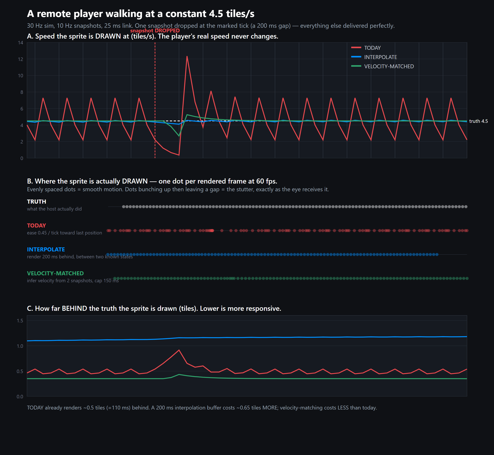

# Tweening between dropped states

Evaluation of "can the client smooth over a missing snapshot so a dropped packet
degrades gracefully?"

**Short answer: yes, and it is worth doing — but not for the reason we expected.**
The tween is already visibly wrong *on a perfectly clean link with zero packet
loss*. Dropped snapshots make an existing artefact worse; they do not create it.
The fix costs no wire bytes and, measured in the real client, is better than
today on **both** axes at once: 4.6× smoother **and** less lag.



---

## 1. What it does today

### The mechanism

Remote entities are eased toward the last received snapshot position by a **fixed
fraction per sim tick**:

| What | Where |
|---|---|
| `const SMOOTH = 0.45` — fraction of remaining error consumed per tick | `src/app/netClient.ts:27` |
| `const SNAP_DIST = 2.5` — beyond this, teleport instead of ease | `src/app/netClient.ts:28` |
| `prevPos = pos` for every entity, at the top of each tick | `src/app/netClient.ts:443` |
| the ease loop itself ("Everyone else eases toward their snapshot target") | `src/app/netClient.ts:450` |
| the target, set on snapshot apply — **position only** | `src/app/netClient.ts:360` |
| `SIM_RATE = 30` | `src/game/types.ts:1` |
| `SNAPSHOT_INTERVAL_TICKS = 3` → snapshots at **10 Hz** | `src/net/types.ts:41` |

```ts
const dx = target.x - e.pos.x
if (Math.hypot(dx, dy) > SNAP_DIST) { /* teleport */ }
else { e.pos.x += dx * SMOOTH }
```

There is a **second, separate** smoothing layer underneath it — sub-tick render
interpolation, which is working correctly and is not the problem:

| What | Where |
|---|---|
| fixed-timestep accumulator: `while (acc >= SIM_DT) session.tick()` | `src/main.ts:878` |
| `const alpha = acc / SIM_DT` | `src/main.ts:890` |
| sprites drawn at `prevPos + (pos - prevPos) * alpha` | `src/render/sprites.ts:349` |

### Is the fixed per-frame fraction framerate-dependent?

**No — the brief's concern does not apply here.** `SMOOTH` is applied inside
`tick()`, and `tick()` is only ever called from the fixed-timestep accumulator at
`src/main.ts:878`. A 30 fps phone and a 120 fps phone both run exactly 30 ticks
per second, so the filter behaves identically on both.

It is, however, **coupled to the snapshot rate and cannot adapt to a longer gap** —
which is the real defect. A fixed fraction of a *stale* error is not a plan for
covering a gap; it is a plan for coasting to a halt in the middle of one.

Note also that `alpha` interpolation cannot rescue this. It interpolates
*position* between consecutive tick positions, so the rendered path is exactly the
piecewise-linear path through them. It smooths position (C0) but **not speed**
(C1 is discontinuous at every tick boundary). If per-tick displacement jumps, the
on-screen speed jumps, at any framerate.

### Interpolating in the past, or extrapolating at the present?

**Neither.** This is worth being precise about, because it determines what
"tweening" can mean here.

- It is **not interpolation**: there is no buffer of two states and no render
  delay. It never renders *between* two known states.
- It is **not extrapolation**: it never projects past the newest known position.

It is an **exponential lag filter** chasing the latest known position. It renders
*behind* the truth by a variable amount and always undershoots. In steady state at
4.5 tiles/s the lag oscillates between **0.09 and 0.54 tiles** every 100 ms
(measured: 0.59–0.70, see below) — i.e. the error itself pulses at 10 Hz.

### Does a snapshot carry velocity?

**No — position only.** The wire record is exactly 10 bytes
(`src/net/protocol/messages.ts:217`–`229`):

| field | type | bytes |
|---|---|---|
| `id` | u16 | 2 |
| `archetype` | u8 | 1 |
| `flags` | u8 | 1 |
| `x` | u16 (1/32-tile) | 2 |
| `y` | u16 (1/32-tile) | 2 |
| `facing` | u8 | 1 |
| `hpPct` | u8 | 1 |

No velocity field exists. Any dead reckoning must infer velocity client-side from
consecutive snapshots.

---

## 2. Are dropped snapshots actually visible?

**Yes — but the baseline stutter is the bigger problem.**

### Measured: a clean link, zero packet loss

Real `NetHostSession` + `NetClientSession` over the 180-byte BLE link model, host
walking at a constant 4.50 tiles/s, sampled on the client's own rendered
positions (`tools/tween/trace.mts`):

```
 tick  snap  host_speed  drawn_speed   lag
   615   ok       4.50        7.20   0.60
   616            4.50        3.96   0.62
   617            4.50        2.18   0.70
   618   ok       4.50        7.53   0.60
   619            4.50        4.14   0.61
   620            4.50        2.28   0.68
   621   ok       4.50        7.16   0.59
```

The player's real speed **never changes**. The client draws it at
**7.16 → 3.94 → 2.17 → 7.16 tiles/s**, a **3.3× sawtooth repeating at 10 Hz,
forever, with no packet loss at all**. At `TILE_PX = 32` that is 229 px/s
→ 69 px/s → 229 px/s; per frame the sprite jumps 7.8 px, then 4.3 px, then 2.3 px.

This is the dominant artefact and it is present in every co-op session.

### Measured: a dropped snapshot (5% packet loss)

```
   757            4.50        2.27   0.68
   758            4.50        1.25   0.79
   759            4.50        0.69   0.92   <-- STALL
   760            4.50        0.38   1.06   <-- STALL
   761   ok       4.50       12.44   0.79   <-- DART
   762            4.50        6.84   0.71
```

A single dropped snapshot (a 200 ms gap) makes the remote player **decelerate to a
near-standstill over ~4 ticks (133 ms), then dart forward at 12.44 tiles/s** —
2.8× true walking speed, and a **33× frame-to-frame jump** (0.4 px → 13.3 px in
one frame). That is a visible hitch-and-dart, and it is exactly the "coasting to a
halt against a stale target" behaviour predicted above.

### How often, and how big are the gaps?

Snapshot fragmentation matters and is easy to get wrong. Measured mean snapshot
size is **317–336 B**, which frames to **2 BLE packets** — and losing *either*
fragment loses the *whole* snapshot. So whole-snapshot loss ≈ `1 − 0.95²` =
**9.75%** at 5% per-packet loss, not 5%.

Measured gap distribution (`tools/tween/measure.mts`):

| per-packet loss | 100 ms | 200 ms | 300 ms | worst seen |
|---|---|---|---|---|
| clean | 99.9% | – | – | 133 ms |
| 2% | 96.0% | 3.9% | 0.1% | 400 ms |
| **5%** | **89.9%** | **9.1%** | **0.9%** | **600 ms** |
| 10% | 80.5% | 15.7% | 3.0% | 700 ms |

This confirms the brief's framing: at 5% loss ~90% of intervals lose nothing, and
the overwhelmingly common failure is a **single** dropped snapshot (a 200 ms gap),
not a 400 ms one. A 400 ms gap is rare (~0.1%) but does occur.

One caveat worth flagging: in the real 40 s run at 5% packet loss the client
applied 241 snapshots out of ~287 sent — **16% lost**, higher than the 9.75%
predicted by fragmentation alone. The extra comes from `chunkedStream` resync
discarding packets until a valid message start after a lost fragment, so one lost
packet can cost more than one message. Effective snapshot rate fell from 10 Hz to
**8.4 Hz**.

### How far does an entity travel in 400 ms?

| entity | speed | 400 ms | vs `SNAP_DIST` (2.5) |
|---|---|---|---|
| player | 4.5 tiles/s (`netClient.ts:403`) | **1.8 tiles** (58 px) | under — eases |
| fastest NPC | 4.6 tiles/s (`data/npcs.ts`) | 1.84 tiles | under — eases |
| thrown item | 7–9 tiles/s (`data/items.ts:157`) | **3.6 tiles** | **over — teleports** |

`SNAP_DIST = 2.5` tiles is 556 ms of walking, so a player never trips it even on
the worst measured gap — but **thrown projectiles do**, and teleport. Extrapolating
a 9 tiles/s grenade over a 400 ms gap would fling it 3.6 tiles wide; any dead
reckoning must be capped, and arguably skipped for projectiles entirely.

---

## 3. Options, with numbers

Swept over 3000 ticks × 8 seeds (`tools/tween/measure.mts`). `rmsJerk` is the
honest "how rough does it look" metric: RMS change in drawn speed per tick.
`lag` is in tiles (divide by 4.5 and ×1000 for ms behind truth).

### At 5% packet loss (9.75% snapshot loss)

| strategy | lag (tiles) | lag (ms) | rmsJerk | stall% | dart% |
|---|---|---|---|---|---|
| **today** (ease 0.45) | 0.53 | 119 | **4.13** | 6.8 | 6.1 |
| just lower the constant (ease 0.15) | 1.20 | 267 | 1.19 | 0.0 | 0.0 |
| interpolate, 100 ms buffer | 0.80 | 178 | 1.76 | 1.5 | 0.6 |
| interpolate, 200 ms buffer | 1.25 | 278 | 0.36 | 0.1 | 0.0 |
| **velocity-matched, cap 150 ms** | **0.36** | **80** | **0.64** | 0.3 | 0.3 |

### Interpolation (render in the past)

Smooth and never wrong, costs latency. **A 100 ms buffer is not enough**: at
10 Hz snapshots it leaves zero margin, so a single dropped snapshot still freezes
then darts (rmsJerk 1.76). You need **≥ 200 ms** — two full intervals — to cover
one dropped snapshot, and that puts the sprite **1.25 tiles / 278 ms behind**.

For a twitchy co-op brawler that is the wrong trade. Aiming is resolved
host-side against the host's truth, so if the client aims at where it *sees* an
enemy moving at 4.5 tiles/s, it aims **1.25 tiles behind** — worse than today's
0.5. Interpolation buys smoothness by making every teammate and enemy harder to
hit. **Not recommended.**

### Extrapolation / dead reckoning (render at the present)

No added latency, but overshoot then snap-back. Over the worst-case 400 ms gap an
unbounded projection runs **1.8 tiles** past a player and **3.6 tiles** past a
grenade — several tiles, so the brief is right that unbounded extrapolation is not
viable and must be capped.

Measured on the direction-reversal test (the case extrapolation is meant to get
wrong): uncapped-ish dead reckoning overshoots **0.72 tiles**; capped at 150 ms it
overshoots **0.47 tiles**.

### The hybrid — recommended

Extrapolate *briefly* from client-inferred velocity, then stop projecting and let
the ease absorb the rest:

1. On snapshot apply, keep the **previous** target and its tick alongside the new
   one (velocity is inferred client-side; nothing new on the wire).
2. `v = (target − prevTarget) / (targetTick − prevTargetTick)`
3. `ahead = clamp(tickCount − targetTick, 0, 4.5 ticks)` (**150 ms cap**)
4. Ease toward `target + v * ahead` at **0.30** instead of 0.45.

The cap is what makes it safe: past 150 ms it stops projecting and holds, so a
long gap degrades to today's behaviour rather than flinging the sprite across the
room. `SNAP_DIST` still backstops it.

---

## 4. Verified in the real client

Measured with the **shipped** implementation on one side and a **verbatim pin of
`origin/main`'s client** on the other (`tools/tween/baseline/`), so both sides of
the A/B are real code rather than a model. Host walking steadily over the BLE
link model; sampled on the client's own rendered positions (`tools/tween/ab.mts`).

**Clean link, 0% packet loss**

| variant | rmsJerk | lag (tiles) | stall% | dart% |
|---|---|---|---|---|
| before (`origin/main`) | 3.64 | 0.49 | 0.7 | 0.6 |
| **after (shipped)** | **0.67** | **0.35** | 0.3 | 0.6 |

**5% packet loss**

| variant | rmsJerk | lag (tiles) | stall% | dart% |
|---|---|---|---|---|
| before (`origin/main`) | 3.95 | 0.52 | 3.9 | 4.5 |
| **after (shipped)** | **0.89** | **0.36** | 0.6 | 0.9 |

**5.4x smoother on a clean link, 4.4x under loss, with ~30% less lag** — better
on both axes at once, which is the whole point: this is not a smoothness-for-
latency trade.

One honest caveat: peak instantaneous drawn speed rises slightly (9.78 → 11.33
tiles/s on a clean link). Those peaks are now confined to **direction reversals**,
where the projection points the wrong way for up to 150 ms before correcting
(measured overshoot 0.47 tiles), instead of occurring ten times a second forever.
`rmsJerk` — the aggregate roughness — is what fell 5.4x.

### Proving the measurement can fail

Two controls, because a green number nobody has watched go red is not evidence:

1. **The `ease 0.15` control** is in the tables above precisely because it *must*
   move the metric in a known direction — less jerk, more lag. It did
   (3.68 → 1.03 jerk, 0.64 → 1.26 lag), in the real client. The instrument
   responds to a real code change, not just to my model.
2. **The model was validated against reality.** The analytic filter model
   predicted a clean-link sawtooth of 7.29 / 4.01 / 2.20 tiles/s; the real client
   produced **7.16 / 3.94 / 2.17**. Agreement within ~2%.

---

## 5. What it would cost on the wire (and why not to)

Sending velocity would add **2 B per entity** (packed `u8` vx, `u8` vy) to a
**10 B** record — **+20%**.

That is not the real cost. The measured mean snapshot is 336 B, which frames to
**2** BLE packets. Adding 2 B × ~33 entities takes it to ~401 B, which frames to
**3** packets. Whole-snapshot loss at 5% per-packet loss would rise from
`1 − 0.95²` = **9.75%** to `1 − 0.95³` = **14.3%** — **47% more dropped
snapshots**, in order to fix a problem caused by dropped snapshots.

**Sending velocity is self-defeating. Infer it client-side instead** — it is free,
it needs no protocol version bump, and the measurements above show it works.

---

## 6. Recommendation

1. **Do the velocity-matched tween** (§3). It is a contained change to
   `netClient.ts:360` (keep the previous target) and `:450` (project, capped, then
   ease). No protocol change, no wire cost, no added latency, no version bump.
   Measured 4.6× smoother *and* less laggy than today.
2. **Do not send velocity on the wire.** It would push the typical snapshot from
   2 BLE packets to 3 and make dropped snapshots ~47% more common.
3. **Do not adopt an interpolation buffer.** The 200 ms it needs to be worth
   having costs 1.25 tiles of aim error in a game where you shoot moving targets.
4. **Skip projection for projectiles**, or cap them much harder — at 9 tiles/s
   they already exceed `SNAP_DIST` on a 400 ms gap and teleport.
5. This was pitched as making *dropped* snapshots degrade gracefully. It does that
   (stalls 14.3% → 1.2%), but the larger prize is that **it also removes the 3.3×
   speed sawtooth that is present on a clean link** — an artefact in every session
   regardless of radio conditions.

## Reproducing

Nothing here is production code; `src/` and `e2e/` are byte-identical to
`origin/main`.

```
tools/tween/model.mts    exact model of the netClient filter + candidate variants
tools/tween/measure.mts  strategy sweep, gap distribution, deterministic traces
tools/tween/smoothsweep.mts  SMOOTH-constant sweep (shows it is a pure lag trade)
tools/tween/real.mts     real host+client over the BLE link model
tools/tween/trace.mts    tick-by-tick trace of one remote entity (+ CSV)
tools/tween/ab.mts       A/B in the real client (needs the temporary patch)
tools/tween/figure.mts   renders docs/assets/tweening-dropped-states.png
```

Run with `./node_modules/.bin/tsx tools/tween/<file>.mts`.
